# Context-Free Grammars (CFG)

## Exercise 1


```text
S -> aSb |
```
---

## Exercise 2

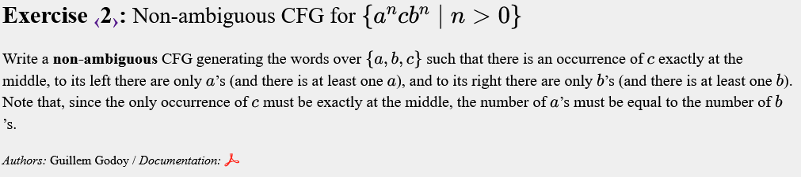
```text
S -> aSb | acb
```
---

## Exercise 3


```text
S -> AB
A -> aA |
B -> aBb |
```
A i B eviten ambigüitats.

---

## Exercise 4


```text
S -> AB
A -> aAb |
B -> bB |
```
---

## Exercise 5


```text
S -> XY
X -> aXbb |
Y -> bY | 
```
---

## Exercise 6


```text
S -> aTb | T
T -> aTbb | aT |
```
---

## Exercise 7


```text
S -> aSbb | T
T -> aT | ab |
```
---

## Exercise 8

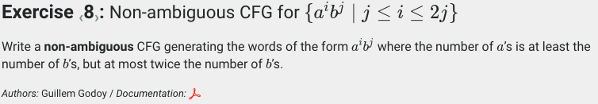
```text
S -> aaSb | X
X -> aXb | 
```
---

## Exercise 9

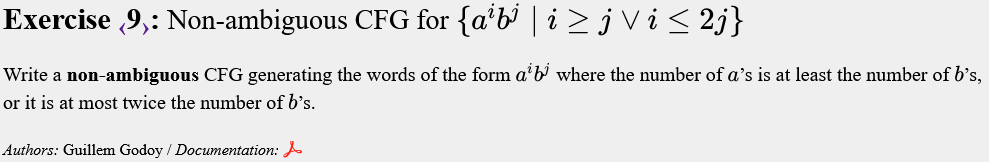
```text
S -> AB
A -> aA |
B -> bB |
```
---

## Exercise 10


```text
S -> aSc | X
X -> aXb |
```
---

## Exercise 11


```text
S -> XY
X -> aXb |
Y -> bYc |
```
---

## Exercise 12


```text
S -> XC | AY | Z

X -> aXb |
Y -> bYc |
Z -> aZc | B

A -> aA|
B -> bB |
C -> cC |
```
---

## Exercise 13


```text
S -> XY
X -> aXa | Yb
Y -> ZY |
Z -> Za | b
```
---

## Exercise 14


```text
S -> aSa | Sb | b
```
---

## Exercise 15


```text
S -> X | Y
X -> aXa | Sb | b
Y -> Ya | Sb | b
```
---

## Exercise 16


```text
S -> aSa | bSb | a | b | 
```
---

## Exercise 17

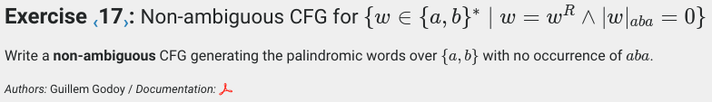
```text
S -> aXa| bSb | a | b |
X -> bYb | aXa | a |
Y -> bSb | b |
```
---

## Exercise 18


```text
S -> aBa | bAb
A -> bAb | aTa | a 
B -> aBa | bTb | b

T -> aTa | bTb | a | b |
```
---

## Exercise 19

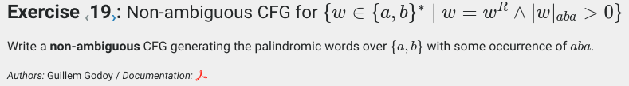
```text
S -> aXa | bSb
X -> bYb | aXa | b
Y -> a | aTa | bSb

T -> aTa | bTb | b | a |
```
---

## Exercise 20


```text
S -> (S)|SS|
```
---

## Exercise 21


```text
S -> SS | (S) | [S] |
```
---

## Exercise 22


```text
S -> (S)S | 
```
---

## Exercise 23

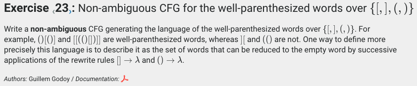
```text
S -> (S)S | [S]S |
```
---

## Exercise 24

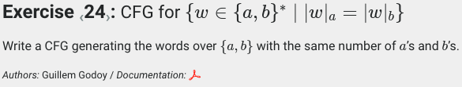
```text
S -> aSbS | bSaS |
```
---

## Exercise 25

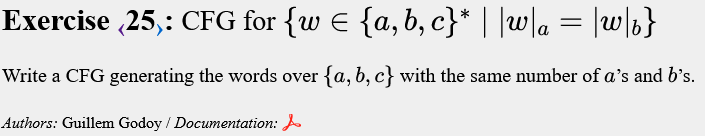
```text
S -> CaSbS | CbSaS | C 
C -> cC |
```
---

## Exercise 26


```text
S -> aScS | cSaS | bScS | cSbS | 
```
---

## Exercise 27


```text
S -> bSbSaS | bSaSbS | aSbSbS | 
```
---

## Exercise 28


```text
S -> aAbS | bBaS |
A -> aAbA | 
B -> bBaB |
```
---

## Exercise 29


```text
S -> CaAbS | CbBaS | C
A -> CaAbA | C
B -> CbBaB | C
C -> cC | 
```
---

## Exercise 30


```text
S -> cXS | bYS | aYS |

X -> a| b | cXX
Y -> c | aYY | bYY
```
---

## Exercise 31


```text
S -> aBBS | bAS | bXBS |
B -> b | aBBB
A -> bX | bAA 
X -> a | bAX
```
---

## Exercise 32


```text
S -> BaSbA | BcA
A -> aA |
B -> bB |
```
---

## Exercise 33


```text
S -> BAabSbaAB | BAcAB
B -> bB |
A -> aA |
```
---

## Exercise 34


```text
S -> aA | bS | F
A -> aA | bB | F
B -> bS | aC | F

C -> Db | Ca
D -> Ea | Db
E -> Ca | Yb

F -> c | Fa | Gb 
G -> Ha | Gb | c
H -> Fa | c

X -> aY | bX | G
Y -> bZ | aY | G
Z -> bX | aD | G
```
---

## Exercise 35

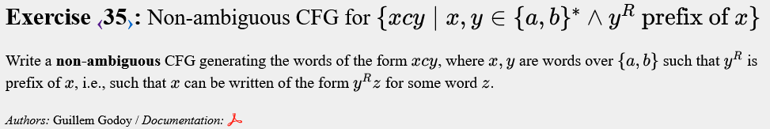
```text
S -> aSa | bSb | T
T -> aT | bT | c 
```
---

## Exercise 36

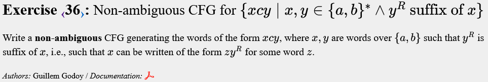
```text
S -> aS | bS | X
X -> aXa | bXb | c
```
---

## Exercise 37


```text
S -> aXT | bST
X -> aYT | bST
Y -> TYT | c

T -> a|b
```
---

## Exercise 38


```text
S ->  X | Y | Z
X -> aXb | aX | a
Y -> aYb |Yb | b
Z -> WbWaW
W -> aW |bW |
```
Els complementaris d'un llenguatge es fan per casos:
- X: |w|<sub>a</sub> > |w|<sub>b</sub>
- Y: |w|<sub>a</sub> < |w|<sub>b</sub>
- Z: Mots amb alguna b abans que una a
---

## Exercise 39

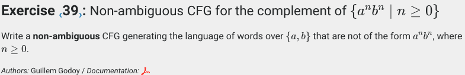
```text
S -> aSb | aXa | bXb | bXa | a | b
X -> aX | bX | 
```
---

## Exercise 40


```text
S -> aSa | bSb | aTb | bTa
T -> aT | bT | 
```
---

## Exercise 41


```text
S -> XbaX | XcaX | XcbX | YC | Z

X -> aX | bX | cX |
Y -> aYb | aA | Bb
Z -> aZc | aAB | BCc

A -> aA |
B -> bB |
C -> cC |
``` 
---

## Exercise 42


```text
S -> X | Y | Z | T
				
X -> AcAcA
A -> aA | bA | cA|

Y -> aY | bY |

Z -> aZa|aZb|bZa|bZb|aYc|bYc|cYa|cYb

T -> LaY | MbY
M -> DMD | aYc 
L -> DLD | bYc

D -> a | b
```
Casos:
- X: |w|<sub>c</sub> >= 2 
- Y: |w|<sub>c</sub> = 0, (i el mot buit λ) 
- Z: |w|<sub>c</sub> = 1 ∧ w = xcy, x != y
- T: |w|<sub>c</sub> = 1 ∧ w = xcy, ∃ i tq x[i] != y[i]
Z i T es complementen, cap de les dues cobreix tots els casos tal i com està implementat.
---

## Exercise 43


```text
E -> N |E O E | (E)
O -> + | - | * | /

N -> 0D | 1D | 2D | 3D | 4D | 5D | 6D | 7D | 8D | 9D 
D -> 0D | 1D | 2D | 3D | 4D | 5D | 6D | 7D | 8D | 9D | 
```
---

## Exercise 44


```text
E -> E+T | E-T | T
T -> T*F | T/F | F
F -> (E) | D

D -> 0D | 1D | 2D | 3D | 4D | 5D | 6D | 7D | 8D | 9D | 0 | 1 | 2 | 3 | 4 | 5 | 6 | 7 | 8 | 9

```
Ordeno per prioritat pels operadors amb associativitat a l’esquerra <br />
'+' '-'  <br />
'*' '/'  <br />
'('')'   <br />

---

## Exercise 45

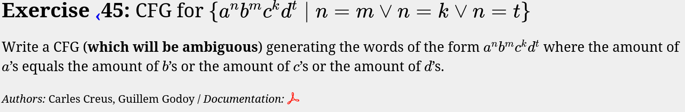
```text
S -> XCD | YD | Z

X -> aXb |
Y -> aYc | B
Z -> aZd | BC

B -> bB |
C -> cC |
D -> dD |

```
Casos:
- X: |w|<sub>a</sub> =  |w|<sub>b</sub> 
- Y: |w|<sub>a</sub> =  |w|<sub>c</sub> 
- Z: |w|<sub>a</sub> =  |w|<sub>d</sub> 

---
