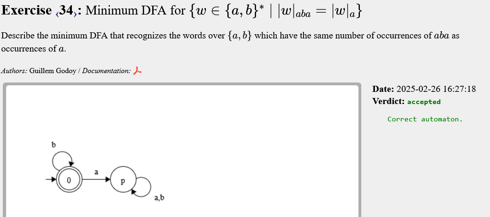

# Deterministic finite automata (DFA)

Amb aquesta llista veiem que cal veure si el DFA que em donen és unió o intersecció d'altres DFA's més petits. O si el negat és més facil que el que em donen, jja que simplifica bastant la feina.

Com agrupo els exercicis
	1-9
	10-14
	15-16 facil
	17 interessant procediment
	18 duplicar el DFA de 1
	19 buscar el contraexemple 
	20-25 múltiples
	26-27 prefixos amb diferència exactament 1
	28 Sufix, es fa a partir del 27
	29? per fer
	30-32 semblants
	33-35 diferencia 1 o més
	36-39 una mica de tot


## Exercise 1


<!-- ```text
    SENSE APUNTS
``` -->

---

## Exercise 2


<!-- ```text
    SENSE APUNTS

``` -->

---

## Exercise 3


<!-- ```text
    SENSE APUNTS

``` -->
---

## Exercise 4


```text
FÀCIL, però s'ha repassat a classe, fet a partir d'un NFA:

- {1,a = 1}, {1,b = 1}, {1,a = 2}
```

---

## Exercise 5


<!-- ```text
    SENSE APUNTS

``` -->
---

## Exercise 6


<!-- ```text
    SENSE APUNTS

``` -->
---

## Exercise 7


<!-- ```text
    SENSE APUNTS

``` -->
---

## Exercise 8


```text
Demostrar que mots amb b imparell concatenat amb mot començat amb a
(el tinc a la llibreta).

```
---

## Exercise 9


```text
Aquí he comès l'error de no posar l'estat pou.

S'acceptaria "abab" on la segona a no compleix la propietat

```

---

## Exercise 10


```text
Mirar partitats, però al principi:

    longitud 1 = a,b
    longitud 2 = 1a1b, 2a2b
    longitud 3 = 2a1b, 1a2b

després es va alternant entre els estats de longitud 2 i 3, però ara "seran
tots de longitud 3", ja que busquem que tota paraula de llargada 3 compleix
la propietat.

```
---

## Exercise 11


```text
Semblant al 10, ara calia veure que b es equivalent a 2a1b i eliminar 
l'estat pou, entre d'altres canvis

```
---

## Exercise 12


```text
A diferència del 10 i 11, que preguntaven per prefixos, el 12 pregunta infixos. Ara tinc forma més "d'arbre" i no tant recursiva, Prenc totes les combinacions per a paraules de longitud 2 i a partir d'aquí, amb el que m'entri puc considerar totes les paraules de longitud 3. Si la 
paraula de longitud 3 no compleix la pemissa descarto el mot sencer, sino, prenc els 2 últims caràcters llegits i continuo.

Ara, en només he de pensar en els 3 últims caràcters (els 2 anteriors i el que acabo de llegir). 

aaa - -> Descarto
aab +
aba + 
abb - -> Descarto
baa +
bab - -> Descarto
bba - -> Descarto
bbb +
```

---

## Exercise 13


```text
El mateix que el 12 (a primera vista) però en lloc de descartar 1a2b cal descartar 1a1b, que en mots de llargada 3 és impossible, s'accepten tots.
```
---

## Exercise 14


```text
La condició de rebujar és no sol passar, es controla i la part complementària 
s'accepta sempre.
```

---

## Exercise 15


<!-- ```text

``` -->

---

## Exercise 16


```text
idèntic al 15 però amb un caràcter diferent, canvia alguna transició de 
tornada als estats anteriors, però és fàcil.
```

---

## Exercise 17


```text
Aquest es l'intersecció de varis DFA's. Es poden obtenir els 3 DFA simles i calcular-ne l'interseccio.

Sense minimitzar són 4*4*4 = 64 estats en total. Evitant varis pous acabes amb 8 estats, que ja són mínims.

```
---

## Exercise 18


```text
Fàcil a simple vista. Fas una vegada abc i si  en llegeixes una altra rebutjes.
```

---

## Exercise 19


```text
Busco b's consecutives amb alguna cadena amb menys de 2 a's
```

---

## Exercise 20


```text
Múltiples de 2 (acabats en 0) i mot buit 
```

---

## Exercise 21


```text
Múltiple de 3, 3 estats:
	x0 = 2x
	x1 = 2x+1
Llegir un 0 és multiplicar per 2 en binari, llegir un 1 és multiplicar per 2 i sumar 1 
```

---

## Exercise 22


```text
Invertir els estats finals i no finals del DFA anterior
```

---

## Exercise 23


```text
Múltiple de 4, ara tinc 3 estats i la mateixa norma:

	x0 = 2x
	x1 = 2x+1

ES INTERESSANT QUE L'ESTAT 3 NO EL TINC PERQUÈ ÉS EQUIVALENT A L'ESTAT 1, TÉ LES MATEIXES TRANSICIONS.
```

---

## Exercise 24


```text
El mateix que el 23 però negant estats acceptadors
```
---

## Exercise 25


```text
Múltiples de 5, aquí s'usen tots els estats, a diferència dels múltiples de 4.

RECORDA:
	x0 = 2x
	x1 = 2x+1
```
---

## Exercise 26


```text
Tota subcadena de longitud 3 ha de tenir exactament dues a's. Es pot mirar per casos, tenint en compte 3 caràcters (tenint en compte els 2 anteriors i el llegit).

Es miren els casos 
	
	{ba,aa,ab}

perque {bb} es rebutja (impossible arribar a dues a's en 3 caràcters).
```
---

## Exercise 27


```text
Tot prefix imparell ha de tenir exactament 1 b més que a's. Això es fer bucle de {ba,ba,ba,}, però també pot ser bucle {bbaa, bbabaa}. El primer bucle és fàcil, és el segon que complica el problema.

```
---

## Exercise 28


```text
Calcular 27 complementari i negar-lo. Després fer el revers, que et retorna un NFA i has  de passar a DFA i determinitzar....

```
---

## Exercise 29


```text
Trobar paraules amb {ab,ba i bb}. Es pot fer de cap pensant bé cada estat.

```
---

## Exercise 30


```text
Cal comptar, els DFAs no poden comptar, però puc tenir constància de la diferència. Al final he definit una funció f:

f(0) = f(1) = 0

f(i) = |w[1]...w[i]|ab - |w[1]...w[i]|ba

El tinc a la llibreta, ab suma aa resta, la resta ho deixen igual
```

---

## Exercise 31


```text
Molt semblant al 30, no canvia gaire
```
---

## Exercise 32


<!-- ```text

``` -->

---

## Exercise 33


```text
Relativament senzill. Et poses a pensar casos. Hi ha un bucle principal a les branques vàlides
```
---

## Exercise 34



<!-- ```text

``` -->
---

## Exercise 35


```text
Molt semblant al 33. Aqui, el que necessites es llegir una a, després pots llegir ba, però no pots llegir cap altra b, pensar casos, aquests son aixi.

```
---

## Exercise 36


```text
Conté alguna seqüència amb 3 b més que a
```

---

## Exercise 37


```text
Mots que es poden dividir d'alguna manera amb el mateix nombre d'as i als dos llocs. És a dir, nombre d'as parell.

```
---

## Exercise 38


```text
Ara el nombre el mot ha de tenir el mateix nombre d'as i b's a les dues parts. Si et fixes, al final pots fer de tot:

	lambda 	accepta
	|a	accepta
	|b 	accepta
	a|b 	accepta
	b|a	accepta
	bb|	accepta
	|aa	accepta	
	|aaa	accepta
	etc etc

```
---

## Exercise 39


```text
Qualsevol mot pertany al llenguatge, es fàcil. Pots triar tantes descomposicions que és impossible canviar-ho
```