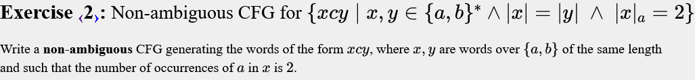
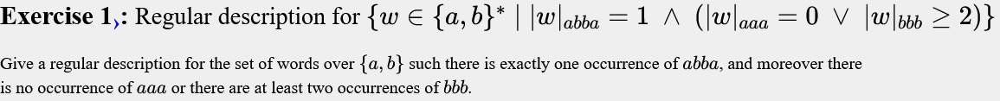
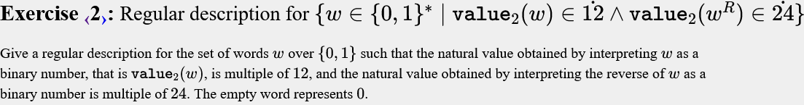
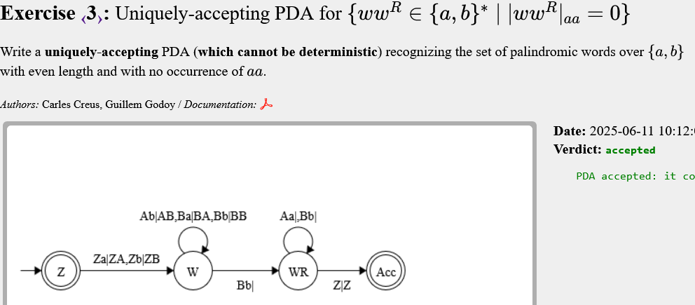
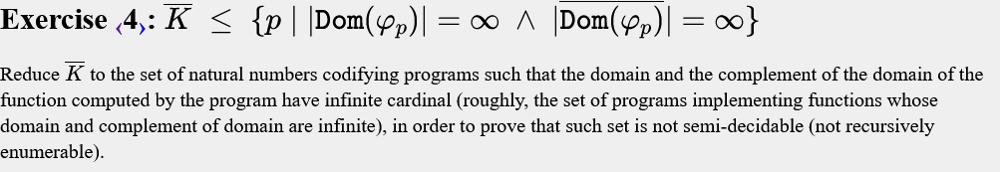
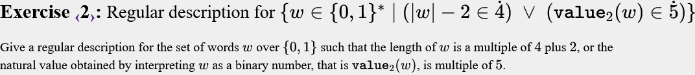
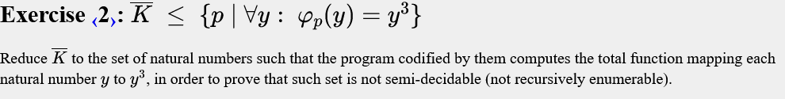
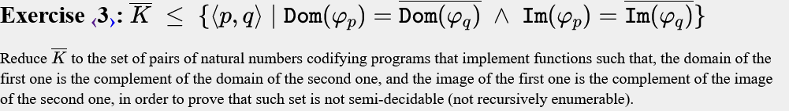

# Exams
## [Exam](https://racso.lsi.upc.edu/juezwsgi/exam?examid=15) on CFGs, March 27th, 2015 
### Exercise 1

```text
S -> aSa | bSb | b |
```
### Exercise 2

```text
S -> bST | aAT
A -> bAT | aBT
B -> bBT | c
T -> a|b
```
### Exercise 3


```text
S ->  XY | aXbYc
X -> aaXb |
Y -> bYcc |
```
## [Exam](https://racso.lsi.upc.edu/juezwsgi/exam?examid=56) on CFGs, March 29th, 2016 
### Exercise 1

```text
S -> aSa | bSb | aXb | bXa
X -> TXT | 
T -> a|b
```

### Exercise 2

```text
S -> BaXbA| BcA 
X -> BaSbA
A -> aA |
B -> bB |
```
## [Exam](https://racso.lsi.upc.edu/juezwsgi/exam?examid=129) on DFAs and CFGs, April 21st, 2021 
### Exercise 1


### Exercise 2


### Exercise 3

Aquest es pot fer minimitzant.
```text
     a    b
0A  1A  _1B +
1A  2A   0B
_1B 0A  _2C
2A   P   1B
0B  1A  _1C +
_2C _1B  P
P    P   P 
1B  2A   0C
_1C 0A  P
0C  1A  P +
```

### Exercise 4

```text
S -> aSa | bXb | a |
X -> aXa | bYb | b
Y -> aYa | bSb  
```

### Exercise 5

```text

S -> AC | YC | AXC | XYC

Y -> bYc | bc
X -> aXb | ab

A -> aA |
C -> cC |
```
Casos:  
- 1) j = 0
- 2) i = 0 (|b| <= |c|)
- 3) 0 < j <= i
- 4) j > i > 0  

Y fa b = c, a S ja poso les Cs extra  
X fa a = b, amb |a| = |b| > 0

### Exercise 6

```text
S -> X | Y | Z | ETX

X -> TX | 
Y -> XcY| XcXcX
T -> a|b

Z -> aZa | bZb | aWb | bWa
W -> TWT | TXc | c

E -> TET | c
```
Casos:  
- 1) mots sense c's
- 2) mots amb 2 c's o més
- 3) |y| <= |x| i yR no es prefix de x
- 4) |y| > |x| i yR no es prefix de x

X i Y fan casos *1* i *2*   
Z i W fan *|y| <= |x|*  
E fa *|y| = |x|*, a S ja es posa *y > x*  

## [Exam](https://racso.lsi.upc.edu/juezwsgi/exam?examid=102) on DFAs and CFGs, November 8th, 2019 
### Exercise 1


### Exercise 2


### Exercise 3


### Exercise 4

```text
S -> BaX
X -> BaXbA | BcA

B -> bB |
A -> aA |
```

### Exercise 5

```text
S -> XY
X -> a | bXX
Y -> aY | bY |
```

### Exercise 6

```text
S -> X | Y | Z | ETX

X -> TX | 
Y -> XcY| XcXcX
T -> a|b

Z -> aZa | bZb | aWb | bWa
W -> TWT | TXc | c

E -> TET | c
```
Casos:  
- 1) sense c (1 mot buit)
- 2) mots amb 2 c's o més
- 3) |x| == |y| (i W!= wcwR)
- 4) |x| != |y| (i W!= wcwR)

X fa cas *1*   
Y fa cas *2*     
Z i Q fan cas *3*  
W i R fan cas *4*  

## [Exam](https://racso.lsi.upc.edu/juezwsgi/exam?examid=55) on DFAs, February 29th, 2016 
### Exercise 1


### Exercise 2


### Exercise 3


### Exercise 4


### Exercise 5


## [Exam](https://racso.lsi.upc.edu/juezwsgi/exam?examid=130) on REG+PDA+Reductions, June 4th, 2021
### Exercise 1

```text
main
{
  ab = "a" | "b";
  
  // >=1
  1_o_mes_abba = ab* "abba" ab*;
  // >=2
  2_o_mes_abba = ab* "abba" ab* "abba" ab* | ab* "abbabba" ab*;
  // = 1
  abba = 1_o_mes_abba - 2_o_mes_abba;
  0_aaa = ab* - (ab* "aaa" ab*);
  2_o_mes_bbb = ab* "bbb" ab* "bbb" ab* | ab* "bbbb" ab*;
  
  output abba & ( 0_aaa | 2_o_mes_bbb );
  
}
```
### Exercise 2

```text
main
{
  m3 = " 0 1
      0  0 1 +
      1  2 0
      2  1 2 ";

  m4 = (("0" | "1")* "00") | "0" | "";
  m8 = (("0" | "1")* "000") | "00" | "0" | "";
  
  output ((m3 & m4) & reverse(m3 & m8));
}
```
### Exercise 3


### Exercise 4

```text
input y
{
  if (y %2 == 0) accept;
  runmxx;
  accept;
}
```

 Si x ∈ !K, tenim: 
 - Dom(φp) = {x | x ∈ ℕ ∧ x % 2 = 0} ⇒ ∣Dom(φp​)∣ = ∞
 - !Dom(φp) = {x | x ∈ ℕ ∧ x % 2 = 1} ⇒ !∣Dom(φp​)∣ = ∞

 Si x ∈ K, tenim:
  - Dom(φp) = ℕ ⇒ ∣Dom(φp​)∣ = ∞
  - !Dom(φp) = ∅ ⇒ !∣Dom(φp​)∣ = 0
<!-- ### Exercise 5
 -->


## [Exam](https://racso.lsi.upc.edu/juezwsgi/exam?examid=57) on REG+CFG+PDA, April 25th, 2016
<!--  
### Exercise 1
Not in this course
-->
### Exercise 2

```text
main
{
  01 = ("0"|"1");

  m5 = " 0 1
       0 0 1 +
       1 2 3
       2 4 0
       3 1 2
       4 3 4";

  output (01 01 01 01)* (01 01) | m5;
}
```
<!-- 
### Exercise 5

```text
main
{
???
}
``` -->


## [Exam](https://racso.lsi.upc.edu/juezwsgi/exam?examid=58) on Reductions, May 30th, 2016 
### Exercise 2

```text
input y
{
  if (mxxstopsininputsteps) output 1;
  output y*y*y;
}
```
 Si x ∈ !K, ∀y:φp​(y)=y3
 Si x ∈ K, ∃y:φp​(y)=1 (∀y > t steps)

 ### Exercise 3

```text
input y
{
  if (y % 2 == 0) output y;
  runmxx;
  output y;
}

input y
{
  if (y % 2 != 0) output y;
  runmxx;
}
```
 Si x ∈ !K, p retorna i accepta parells, q retorna i accepta imparells 
 Si x ∈ K, p retorna i accepta y, q retorna i accepta imparells