# K-Reductions
<!-- Alguns caràcters 
  EXISTS       -> ∃ 
  FORALL       -> ∀ 
  PHI          -> φ
  NATURALS     -> ℕ
  IMPLIES      -> ⇒
  INTERSECTION -> ∩
  UNION        -> ∪
-->

## Exercise 1


```text
input y
{
  runmxx;
  accept;
}
```
 Si x ∈ K, la màquina para i accepta per tot x

 Si x ∈ !K, la màquina no para per tot x

---

## Exercise 2


```text
input y
{
  if (mxxstopsininputsteps)
    infiniteloop;
  accept;	
}
```


 Si x ∈ K, la màquina para i accepta
 
 Si x ∈ !K, la màquina es queda penjada a l'infinite loop


---

## Exercise 3

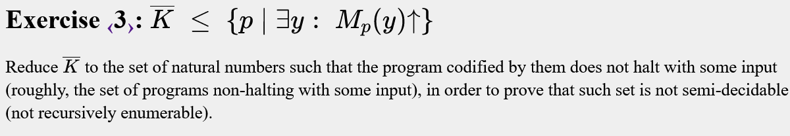
```text

input y
{
  runmxx;
}

```

 Si x ∈ !K, llavors la màquina mai para

 Si x ∈ K, llavors la màquina sempre para

---

## Exercise 4

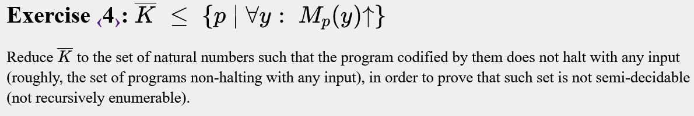
```text

input y
{
  runmxx; 
}

```
 Aquesta màquina pot ser la mateixa que al 3, ja que al programar ∃ x ja havia fet ∀ x:

 Si x ∈ !K llavors la màquina mai para

 Si x ∈ K llavors la màquina sempre para

---

## Exercise 5

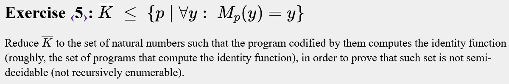
```text

input y
{
  if (not mxxstopsininputsteps) output y;
  output y+1;
}

```

 Si x ∈ !K, la màquina para i retorna y

 Si x ∈ K,  la màquina para i retorna y + 1

---

## Exercise 6

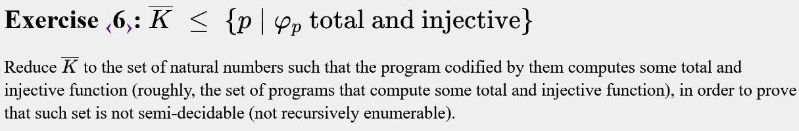
```text

input y
{
  if (not mxxstopsininputsteps) output y;
  else output 1; 
}

```


Tipus de funcions:
- TOTAL -> Definida per tot el domini
- INJECTIVA -> Tota imatge té una única antiimatge

 Si x ∈ !K la màquina retorna y (injectiva)

 Si x ∈ K la màquina retorna 1 (no injectiva)

---

## Exercise 7

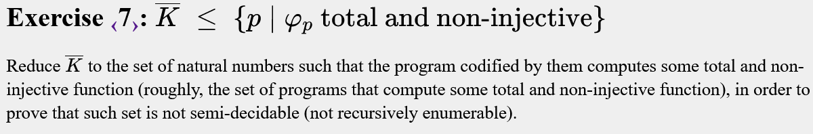
```text

input y
{
  if (not mxxstopsininputsteps) output 1;
  else infiniteloop;
}

```


 Si x ∈ !K la màquina retorna 1 (no injectiva)

 Si x ∈ K la màquina fa infinite loop.
 
Al cas negatiu (x ∈ K) cal anar amb compte, ja que si es fes output tindriem una funció definida per parts (una barreja de 1 i y), de forma que f(x) retorna 1 per a x < t, i a partir de x = t retorna y:


                 |
               y |         _________
                 |        /
               1 |_______/
                 |
                 +-------------------
                         t          x
        
---

## Exercise 8

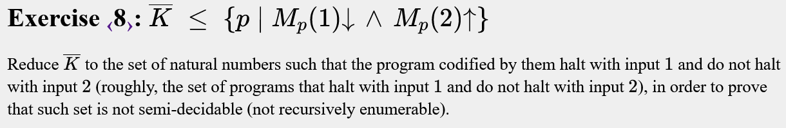
```text

input y
{
  if (y == 1) accept;
  else if (y == 2) runmxx;
}

```

 Si x ∈ !K la màquina  <br />
- acaba si y == 1 (accept)
- no acaba si y == 2 (mxx no acaba)


 Si x ∈ K la màquina  <br />
- acaba si y == 1 (accept)
- acaba si y == 2 (mxx acaba)

---

## Exercise 9


```text

input y
{
  runmxx;
  output y;
}

```

 Si x ∈ K la màquina té |Dom(φp)| = ∞

 Si x ∈ !K la màquina no para, pel que té |Dom(φp)| =  0

---

## Exercise 10

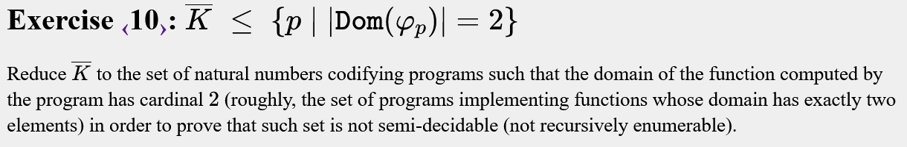
```text

input y
{
  if (y == 0 or y == 1) output y; 
  runmxx;
  output y;
}

```

 Si x ∈ !K la màquina no para, s'accepten els valors {1,2} ⇒ ∣Dom(φp)∣ = 2

 Si x ∈ K la màquina accepta tots els valors |Dom(φp)| = ∞ > 2

---

## Exercise 11


```text

input y
{
  runmxx;
  output y;
}

```

 Si x ∈ K la màquina té |Im(φp​)| = ∞

 Si x !K la màquina té |Im(φp​)| = 0

---

## Exercise 12


```text

input y
{
  if (mxxstopsininputsteps) output y;
  if (y % 2 == 0) output 0;
  else output 1;
}

```

 Si x ∈ !K la màquina té imatge {0,1}, |Im(φp​)| = 2

 Si x ∈ K la màquina té d'imatge ℕ, |Im(φp​)| = ∞

---

## Exercise 13


```text

input y
{ 
  if (mxxstopsininputsteps) output y;
  if (y % 2 == 0) output y+1;
}

```

Els parells i imparells tenen bastant sentit quan  es demanen conjunts infinits sense intersecció:

 Si x ∈ !K la màquina té ∣Dom(φp​)∣ = ∞, ∣Im(φp​)∣ = ∞ i Dom(φp​) ∩ Im(φp​) = ∅, ja que:

  - Dom(φp​) = {x | x ∈ ℕ ∧ x % 2 = 0}
  - Im(φp​) = {x | x ∈ ℕ ∧ x % 2 = 1}
    

 Si x ∈ K la màquina té ∣Dom(φp​)∣ = ∞, ∣Im(φp​)∣ = ∞ i Dom(φp​) ∩ Im(φp​) = ∞, ja que:

  - Dom(φp​) = Im(φp​) = {x | x ∈ ℕ }

---

## Exercise 14


```text

input y
{
  runmxx;
}

input y
{

}

```

 Si x ∈ K les maquines paren, (∃x perquè es compleix ∀x)

 Si x ∈ !K la màquina p no para (!∃x)

---

## Exercise 15

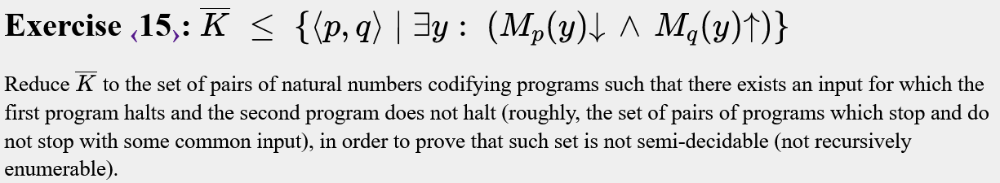
```text

input y
{
  runmxx;
}

input y
{

}

```

 Si x ∈ K les maquines paren, (∃x perquè es compleix ∀x)

 Si x ∈ !K la màquina q no para (!∃x)

---

## Exercise 16


```text

input y
{
  if (y == 2) runmxx;
  if (y == 1) accept; 
}

input y
{
  if (y == 1) runmxx;
  if (y == 2) accept;
}

```

 Si x ∈ !K
 -  Mp para (per y1 = 1) i Mq para (per y2 = 2)

 Si x ∈ K
 - Mp para  Mq també  ∀ y

---

## Exercise 17

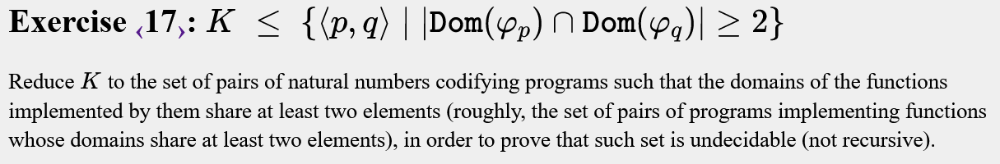
```text

input y
{
  if (y == 0) accept;
  runmxx;
  accept;
}

input y
{
  accept;
}

```

 Si x ∈ K, les maquines tenen ℕ com a domini ⇒ |Dom(φp​) ∩ Dom(φq​)| >= 2

 Si x ∈ !K, les maquines tenen en comú {0} ⇒ |Dom(φp​) ∩ Dom(φq​)| = 1

---

## Exercise 18

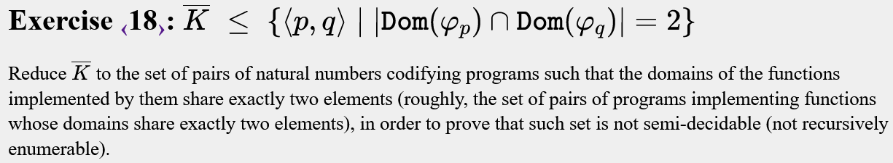
```text

input y
{
  if (y == 0 or y == 1) accept;
  runmxx;
  accept;
}

input y
{
  accept;
}

```

 Si x ∈ !K, les maquines tenen en comú {0,1} ⇒ |Dom(φp​) ∩ Dom(φq​)| = 2

 Si x ∈ K, les maquines tenen ℕ com a domini ⇒ |Dom(φp​) ∩ Dom(φq​)| >= 2

---

## Exercise 19

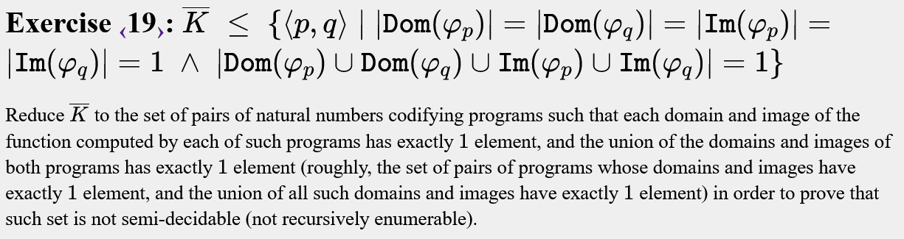
```text

input y
{
  if (y == 0) output 0;
  runmxx;
  output 1;
}

input y
{
  if (y == 0) output 0;
  runmxx;
  output 1;
}

```

Si x ∈ !K, tenim {0} als dominis i imatges de les funcions, pel que: <br />

- ∣Dom(φp​)∣ = ∣Dom(φq​)∣ = ∣Im(φp​)∣ = ∣Im(φq​)∣ = 1 ∧ ∣Dom(φp​) ∪ Dom(φq​) ∪ Im(φp​) ∪ Im(φq​)∣ = 1

Si x ∈ K, tenim:
 
- Im(φp​) = Im(φq​) = {0,1}  ⇒ |Im(φp​)| = |Im(φq​)| = 2

- Dom(φp​) = Dom(φq​) = ℕ  ⇒ |Dom(φp​)| = |Dom(φq​)| = ∞

---

## Exercise 20


```text

input y
{
  if (y == 0) output 0;
  runmxx;
  output 1;
}

input y
{
  if (y == 1) output 1;
  runmxx;
  output 1;
}

```

 Si x ∈ !K, tenim:
  - Dom(φp​) = Im(φp) = {0} 
  - Dom(φq) = Im(φq) = {1} 
  
  Pel que ∣Dom(φp​)∣ = ∣Dom(φq​)∣ = ∣Im(φp​)∣ = ∣Im(φq​)∣ = 1 ∧ ∣Dom(φp​) ∪ Dom(φq​) ∪ Im(φp​) ∪ Im(φq​)∣ = 2

 Si x ∈ K, tenim:
   - Dom(φp​) = Dom(φq) = ℕ  ⇒ |Dom(φp​)| = |Dom(φq​)| = ∞
   - Im(φp) = {0,1}  ⇒ |Im(φp​)| = 2
   - Im(φq) = {1}  ⇒ |Im(φq​)| = 1

---

## Exercise 21


```text

input y
{
  if (y == 0) output 1;
  runmxx;
  output 1;
}

input y
{
  if (y == 1) output 2;
  runmxx;
  output 1;
}

```

 Si x ∈ !K, tenim:
  - Dom(φp) = {0}
  - Im(φp) = {1}
  - Dom(φq) = {1}
  - Im(φq) = {2}
  - L'unió dels seus dominis i imatges és {0,1,2}
  - ∣Dom(φp)∣ = ∣Im(φp)∣ = ∣Dom(φq)∣ = ∣Im(φq)∣ = 1
  - ∣Dom(φp) ∪ Dom(φq) ∪ Im(φp) ∪ Im(φq)∣ = 3

 Si x ∈ K, tenim:
  - Dom(φp) = Dom(φq) = ℕ
  - Im(φp) = {1}
  - Im(φq) = {1,2}
  - ∣Dom(φp)∣ = ∣Dom(φq)∣ = ∞
  - ∣Im(φp)∣ = 1
  - ∣Im(φq)∣ = 2

---

## Exercise 22


```text

input y
{
  if (y == 0) output 1;
  runmxx;
  output 1;
}

input y
{
  if (y == 2) output 3;
  runmxx;
  output 1;
}

```

 Si x ∈ !K, tenim:
  - Dom(φp) = {0}
  - Im(φp) = {1}
  - Dom(φq) = {2}
  - Im(φq) = {3}
  - L'unió dels seus dominis i imatges és {0,1,2,3}
  - ∣Dom(φp)∣ = ∣Im(φp)∣ = ∣Dom(φq)∣ = ∣Im(φq)∣ = 1
  - ∣Dom(φp) ∪ Dom(φq) ∪ Im(φp) ∪ Im(φq)∣ = 4

 Si x ∈ K, tenim:
  - Dom(φp) = Dom(φq) = ℕ
  - Im(φp) = {1}
  - Im(φq) = {1,3}
  - ∣Dom(φp)∣ = ∣Dom(φq)∣ = ∞
  - ∣Im(φp)∣ = 1
  - ∣Im(φq)∣ = 2

---

## Exercise 23


```text

input y
{
  if (y == 0) output y;
  runmxx;
  output y;
}

input y
{
  if (y == 0) output y;
  runmxx;
  if (y == 1) output y;
  reject;
}

```

 Si x ∈ !K, tenim:
  - Dom(φp) = Dom(φq) = {0} ⇒ Dom(φp​)⊆ Dom(φq​)

 Si x ∈ K, tenim:

  - Dom(φp) = ℕ
  - Dom(φq) = {0,1}  ⇒ Dom(φp​)⊈ Dom(φq​)

---

## Exercise 24


```text

input y
{
  if (y == 0) output y;
  runmxx;
  output y;
}

input y
{
  if (y == 0 or y == 1) output y;
  runmxx;
  reject;
}

```

 Si x ∈ !K, tenim:
  - Dom(φp) =  {0}
  - Dom(φq​) = {0,1} ⇒ Dom(φp)⊂ Dom(φq)

 Si x ∈ K, tenim:
  - Dom(φp) =  ℕ
  - Dom(φq​) = {0,1} ⇒ Dom(φp)⊄ Dom(φq)

---

## Exercise 25

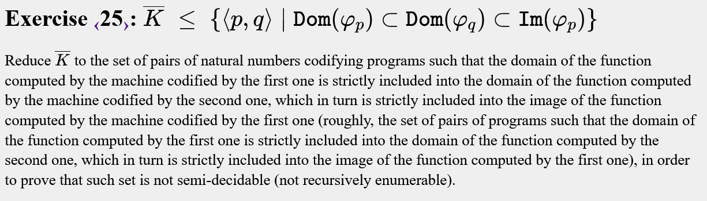
```text

input y
{
  if (y == 0 or y == 1) reject;
  output y - 2;
}
 
input y
{
  if (y == 0) {
    runmxx;
    output y;
  }
  output y;
}

```

 Si x ∈ !K, tenim:
  - Dom(φp) = {2,...∞}
  - Dom(φq) = {1,...∞}
  - Im(φp) = {0,...∞}
  Veiem, doncs, com Dom(φp) ⊂ Dom(φq) ⊂ Im(φp), ja que {2,...∞} ⊂ {1,...∞} ⊂ {0,...∞}

 Si x ∈ K, tenim:
  - Dom(φp) = {2,...∞}
  - Dom(φq) = {0,...∞}
  - Im(φp) = {0,...∞}
  Veiem, doncs, com Dom(φp) ⊂ Dom(φq) ⊄ Im(φp), ja que {2,...∞} ⊂ {0,...∞} ⊄ {0,...∞}

---

## Exercise 26

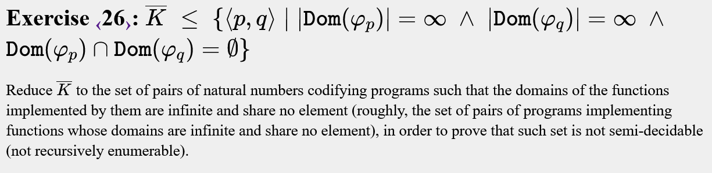
```text

input y
{
  if (y % 2 == 0) runmxx;
  output y;
}

input y
{
  if (y % 2 != 0) runmxx;
  output y;
}

```

 Si x ∈ !K, tenim: 
 - Dom(φp) = {x | x ∈ ℕ ∧ x % 2 = 1} ⇒ ∣Dom(φp​)∣ = ∞
 - Dom(φq) = {x | x ∈ ℕ ∧ x % 2 = 0} ⇒ ∣Dom(φq​)∣ = ∞
 Veiem, doncs, que:
  Dom(φp​) ∩ Dom(φq​) = ∅

 Si x ∈ K, tenim:
  - Dom(φp) = Dom(φq) = ℕ ⇒ ∣Dom(φp​)∣ = ∣Dom(φq​)| = ∞
 Veiem, doncs, que:
  Dom(φp​)∩ Dom(φq​) = ℕ

---

## Exercise 27

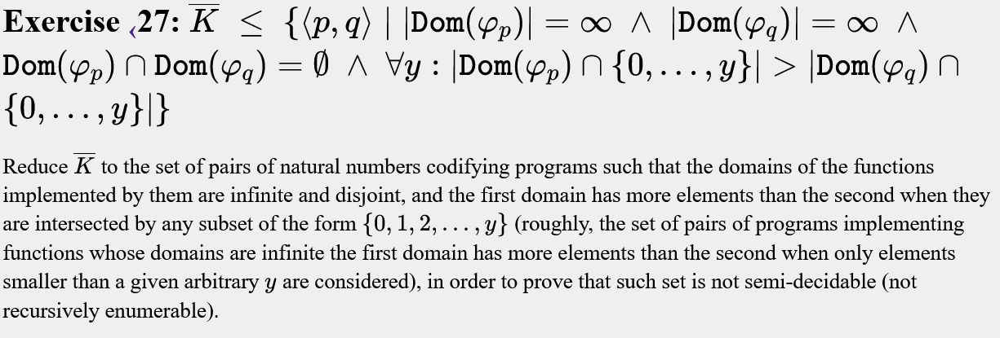
```text

input y
{
  if (mxxstopsininputsteps) reject;
  if (y % 2 == 0) output y;
}

input y
{
  if (y % 2 != 0 and y != 1) output y;
}

```
Si x ∈ !K, tenim: 
 - Dom(φp) = {x | x ∈ ℕ ∧ x % 2 = 0} 
 - Dom(φq) = {x | x ∈ ℕ ∧ x % 2 = 1 ∧ x > 1}  <br />

És a dir:
 - Dom(φp) = {0,2,4,6,...} 
 - Dom(φq) = {3,5,7,...}  <br />

Per a qualsevol nombre natural *y*, si considerem la llista {0, ..., y}, sempre hi haurà com a mínim un element més a Dom(φp) que a Dom(φq). Això és perquè Dom(φp) inclou tots els parells començant pel 0, mentre que Dom(φq) només inclou els senars estrictament majors que 1 (és a dir, a partir de 3). Per tant, dins de qualsevol interval finit, Dom(φp) sempre tindrà més elements que Dom(φq).

 Si x ∈ K, tenim Dom(φp) = ∅ ⇒ ∣Dom(φp​)∣ = 0

---