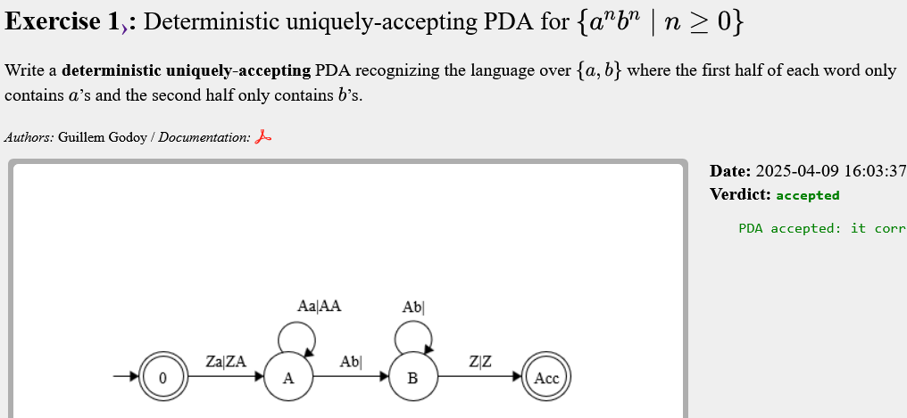
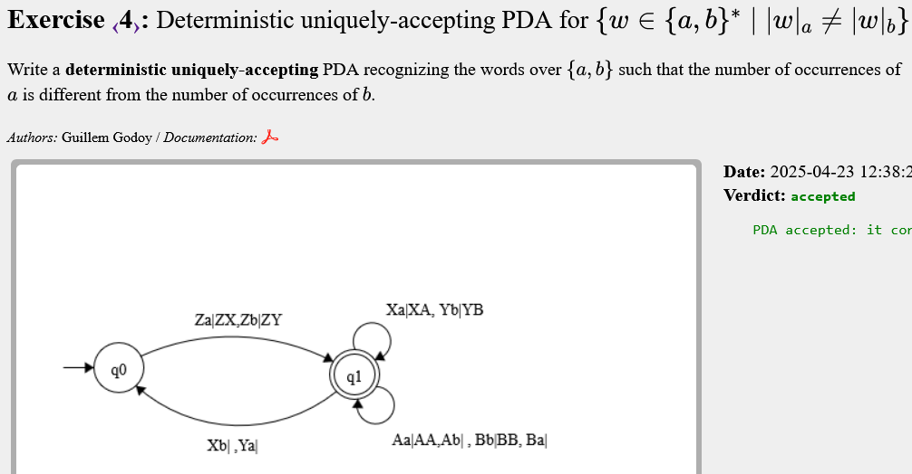
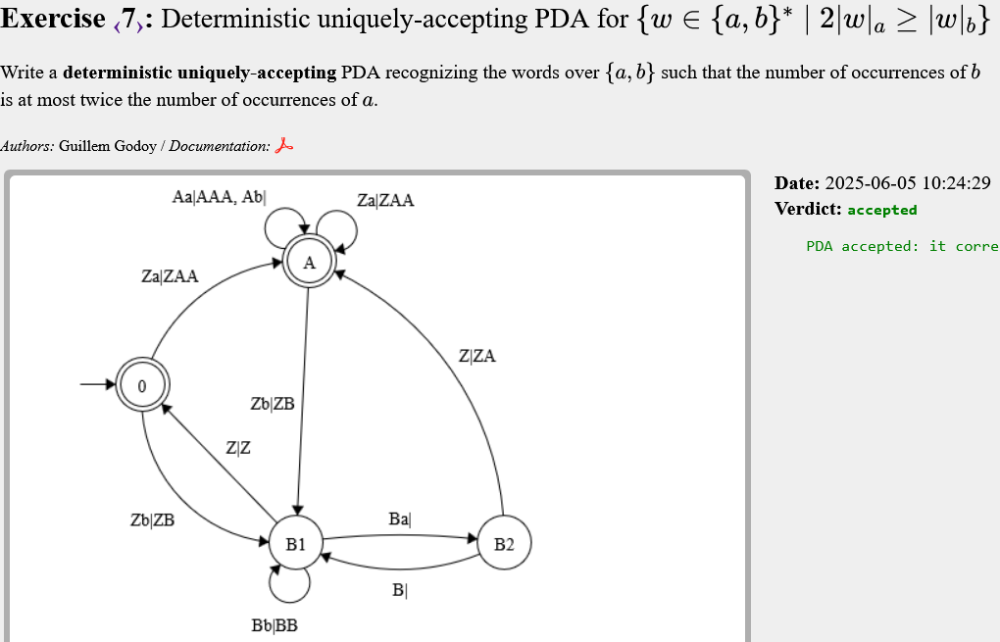
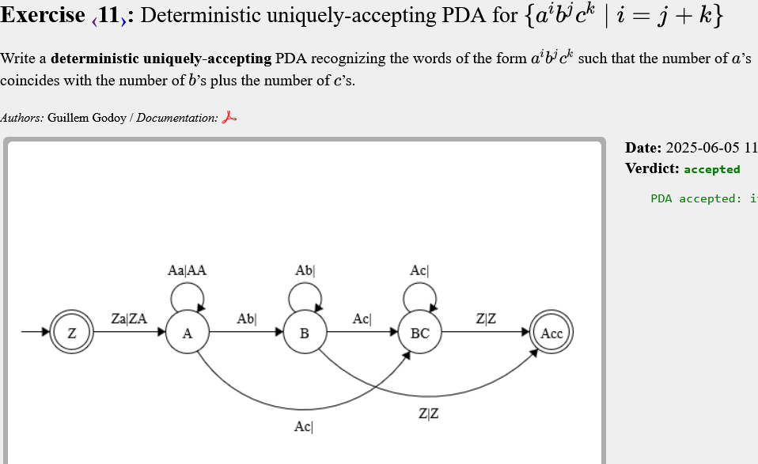

# Pushdown automata (PDA)

### Deterministic
- No hi ha ambigüitats: per a cada estat, símbol d’entrada i símbol de pila, hi ha una única transició possible.

### Uniquely-accepting
- Només pot haver-hi una seqüència d’estats i pila condueix a l’acceptació per a cada paraula de l’alfabet.

## Exercise 1

Empilo una A quan llegeixo una a i desempilo la A quan llegeixo una b, és un matching.

---

## Exercise 2

La mateixa idea, però quan llegeixo una B borro dues a's, per mantenir êl doble d'as que de b's.

---

## Exercise 3

Es pot resoldre amb un PDA determinista uniquely-accepting, perquè només cal igualtat entre 'a' i 'b'. Amb la pila podem cancel·lar l'una amb l'altra de manera precisa.

---

## Exercise 4

Ara no és igualtat. Intentar acceptar paraules amb pila no buida genera ambigüitat: una mateixa paraula pot tenir dues execucions. Afegir símbols X i Y per marcar la primera 'a' o 'b' ajuda a forçar acceptació única.

---

## Exercise 5

No és igualtat. Encara cal X i Y per garantir una única execució acceptadora. No es pot acceptar amb només canviar els estats finals: cal controlar l’origen del desfasament ('a' o 'b').

---

## Exercise 6

Aquest torna a tenir igualtat. El truc es escriure 2 símbols A a la pila al llegir 'a' per mantenir l'equilibri. La transició més important la que hi ha entre B2 i A, per si de cas llegeixo ba, necessitaré llegir més b's. Cal recordar afegir les transicions Z|Z.

---

## Exercise 7

Ara tampoc és igualtat, però no cal usar X i Y. A partir de l'exercici 6 cal:
 - Convertir A en estat acceptador 
 - Borrar la transició Z|Z (A -> 0)
 - Transició Za|ZAA (A -> A)
 - Transició Zb|ZB (A -> B1)
Tot això puc fer-ho perquè veig que a l'estat A tinc 2∣w∣a​≥∣w∣b

---

## Exercise 8

Ara és fer exactament al revés:
 - Convertir B1 en estat acceptador 
 - Borrar la transició Z|Z (B1 -> 0)
 - Transició Zb|ZB (B1 -> B1)
 - Transició Za|ZAA (B1 -> A)
Tot això puc fer-ho perquè veig que a l'estat B1 tinc 2∣w∣a≤∣w∣b

---

## Exercise 9

Ara ja em diu *cannot be determnistic*, perquè no hi ha manera determinista de verificar la condició j ≤ i ≤ 2j només amb una pila, usant un únic camí. 

Faig el límit superior i inferior de l'interval, de manera que hi haurà dues branques possibles:
- i = j 
- i = 2j
Cal anar en compte amb com es fa el canvi entre llegir a's i llegir b's, pot donar problemes. L'execució podrà escollir el camí d'igualtat (j) , una barreja del doble i igual (j i 2j) per tenir valors a [j, 2j], o només doble (2j).

---

## Exercise 10

Bastant llarg, però es pot anar construint de mica en mica.

---

## Exercise 11

Fàcil, tan b com c borren a's.

---

## Exercise 12

La idea es separar per exponents. Tenim:

	a(i) b(i) b(k) c(k)

Llegeixo, doncs, 4 grups diferents. Faig un estat intermedi amb |a|=|b| per si de cas no tinguessim c's

---

## Exercise 13

Aquí hi ha molts estats, però l'idea és simple, perquè al ser no determinista puc fer els dos camins:
- |a| = |b|
- |a| = |c|
Hi ha bastants casos, fàcil oblidar *bs* i *cs*.

---

## Exercise 14

Molt semblant a l'anterior.

---

## Exercise 15

Semblant als dos anteriors. Ara, però, cal que sigui uniquely accepting, només pot haver-hi un camí acceptador per cada mot. Pel que fer:

- Camí per {aibjckd∣i=j}
- Camí per {aibjcke∣j=k}

Hi ha molts casos dins de cada camí.

---

## Exercise 16

No és determinista perquè no podem saber on serà el punt mig. Aquí l'idea és tenir la part de l'esquerra, i si es senar s'ignora el símbol a la meitat de la paraula (si es parell no), per fer un matching amb la resta de caràcters que havíem vist a la part esquerra del mot.

---

## Exercise 17

Obrir i tancar, cal pensar que podem tenir ()().

---

## Exercise 18

Pràcticament el mateix que el 17, però amb () i []. Això fa que quan tinguem un paràntesi obert d'un tipus, en puguem obrir un d'un altre tipus.

---

## Exercise 19

Aquí es compten els caràcters que ens interessen a cada costat de la c, a l'esquerra s'afegeix símbol i a la dreta s'elimina.

---

## Exercise 20

La mateixa idea que al 19, però amb més casos, ja que comptem seqüències *ab* i *ba*. Usaré símbols `X` a la pila per marcar el progrés de cada seqüència.

---

## Exercise 21

Bastant llarg, però al final és pensar casos, igual que el 20.

---
