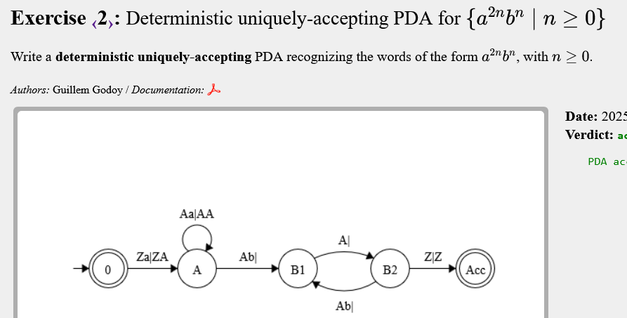
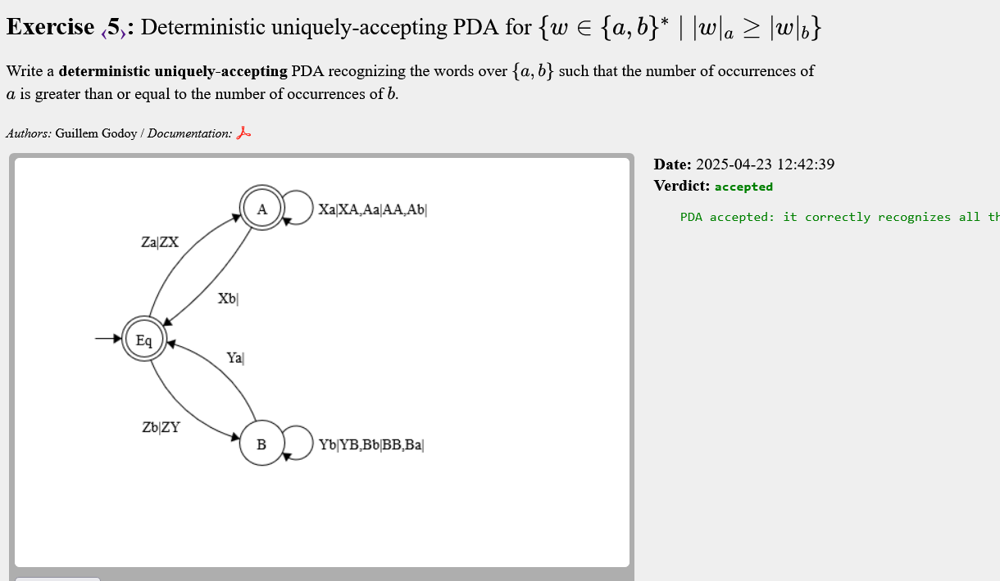
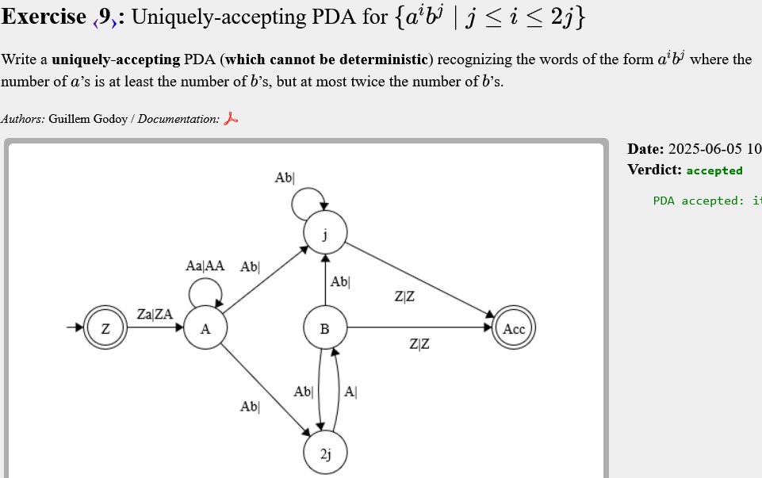
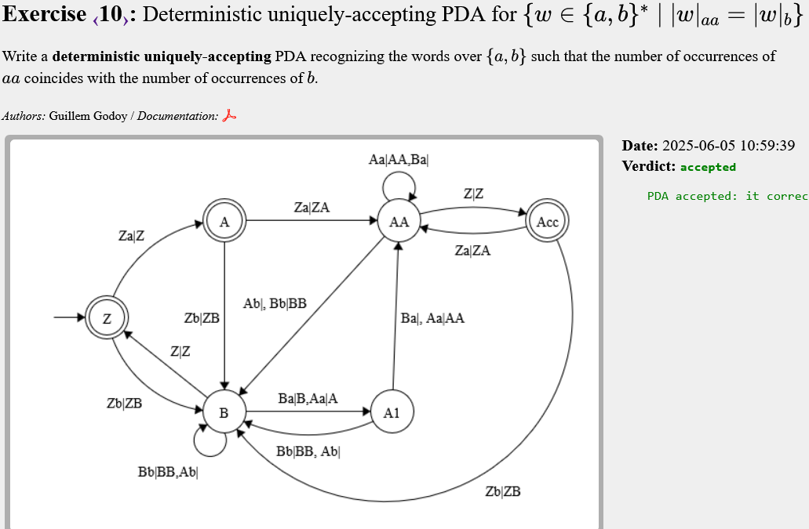
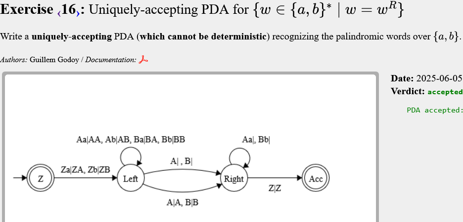
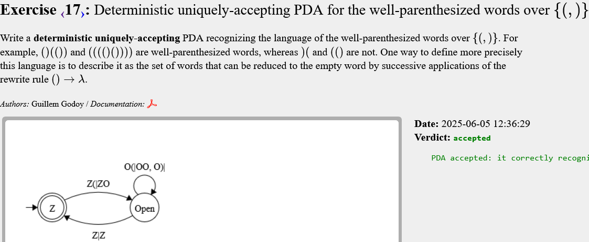

# PDA

## Exercise 1


<!-- ```text
    SENSE APUNTS
``` -->

---

## Exercise 2



<!-- ```text
    SENSE APUNTS

``` -->

---

## Exercise 3


<!-- ```text
    SENSE APUNTS

``` -->
---

## Exercise 4


```text
Aquí afegeixo els símbols X i Y que representen la primera a i la primera b llegida.
```

---

## Exercise 5



<!-- ```text
    SENSE APUNTS

``` -->
---

## Exercise 6


```text
Mirar per casos, s'entén millor:

    abb
    bba
    bab

Aquests serien els base, i hauria de funcionar amb recursius:

    ab, per exemple.

La transició mer important la que hi ha entre B2 i A, per si de cas llegeixo BA, les transicions Z|Z també deleguen els subproblemes a l'estat inicial i simplifiquen el probema general.
```
---

## Exercise 7


```text
Ara s'ha d'afegir transicions de l'estat A a l'estat B
```
---

## Exercise 8


<!-- ```text
    SENSE APUNTS

``` -->
---

## Exercise 9



<!-- ```text
    SENSE APUNTS

``` -->

---

## Exercise 10



<!-- ```text
    SENSE APUNTS

``` -->
---

## Exercise 11


<!-- ```text
    SENSE APUNTS

``` -->
---

## Exercise 12


```text
La idea es separar per exponents, però cal anar amb compte a i o k pot ser zero. Tenim:

	a(i) b(i) b(k) c(k)

Llegeixo, doncs, 4 grups diferents. Faig un estat intermediamb |a|=|b| per si de cas no tinguessim c's

```

## Exercise 13


```text
La idea es separar per exponents, però cal anar amb compte a i o k pot ser zero. Tenim:

	a(i) b(i) b(k) c(k)

Llegeixo, doncs, 4 grups diferents. Faig un estat intermediamb |a|=|b| per si de cas no tinguessim c's
```

## Exercise 14


```text

```

## Exercise 15


```text

```

## Exercise 16


```text
Aquí el 'truc' està en tenir en compte mots de longitud parella i longitud senar i borrar (o no) el símbol a la meitat de la paraula.
```
## Exercise 17


```text

```
## Exercise 18


```text
No és exactament el mateix que el 17 perquè s'han de tancar els dos () i []

Cal anar en compte, cal posar els casos en que s'obre un parèntesis del tipus ( o ] en qualsevol moment. És bastant evident però s'et pot passar.
```
## Exercise 19


```text

```