# CFG-Reductions
<!-- Alguns caràcters 
  EXISTS       -> ∃ 
  FORALL       -> ∀ 
  PHI          -> φ
  NATURALS     -> ℕ
  IMPLIES      -> ⇒
  INTERSECTION -> ∩
  UNION        -> ∪
  PERTANY      -> ∈
-->

## Exercise 1

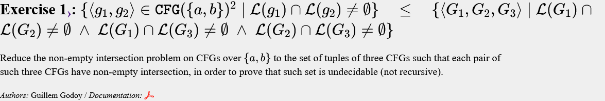
```text
input g1,g2
{
  output g1, g2, g1 | g2;
}
```
---

## Exercise 2

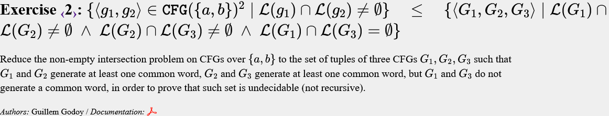
```text
input g1,g2
{
  output g1, g2 | "z", "z";
}
```

---

## Exercise 3

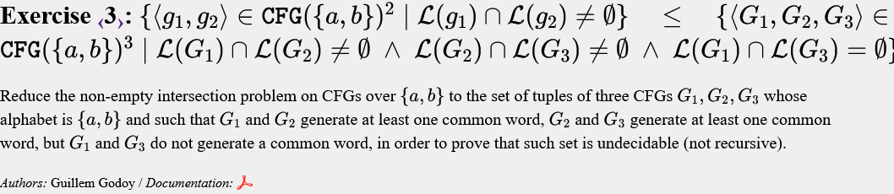
```text
input g1,g2
{
  G1 = substitution(g1, "a" -> "aa");
  G2 = substitution(g2, "a" -> "aa");
  Z = "a";
  output G1, G2|Z, Z;
}
```
Juguem amb la paritat, un mot de Z o G2|Z sempre tindrà |a| != ·2

---

## Exercise 4

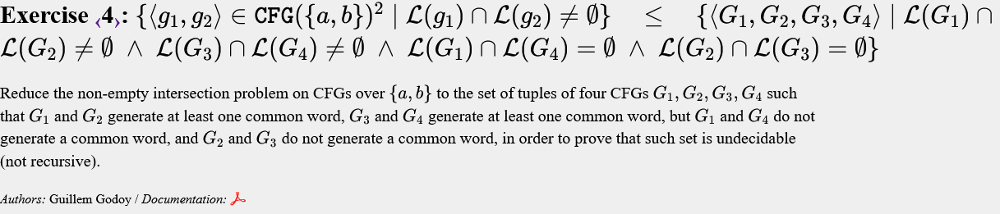
```text
input g1,g2
{
  output g1, g2, "z", "z";
}
```
---

## Exercise 8

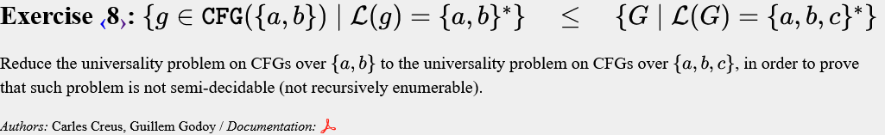
```text
input g
{
  output substitution(g, "a" -> "a"|"c");
}
```
---

## Exercise 9

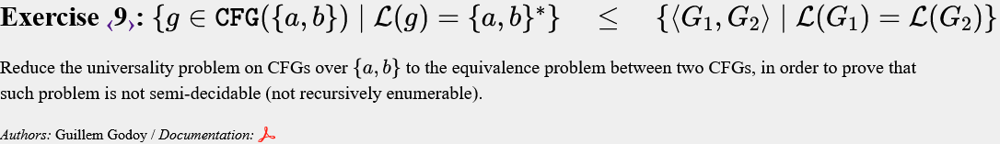
```text
input g
{
  output g , ("a"|"b")* ;
}
```

---

## Exercise 10

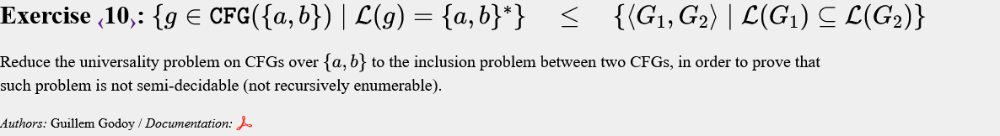
```text
input g
{
  output ("a"|"b")*, g;
}
```

---

## Exercise 11

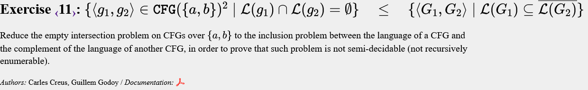
```text
input g1,g2
{
  output g1, g2;
}
```

---

## Exercise 12

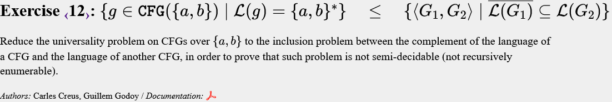
```text
input g
{
  output g, g;
}
```

---

## Exercise 17

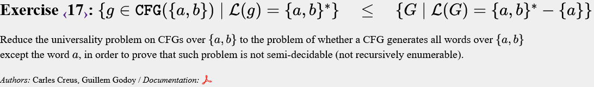
```text
input g
{
  if ("a" belongsto g)
    output g - "a";
  else
    output g | "a";
}
```

---

## Exercise 19

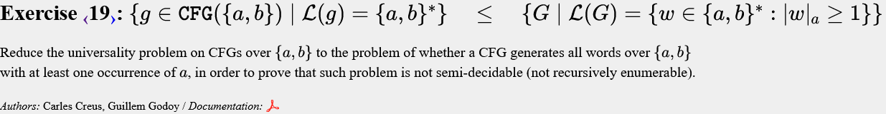
```text
input g
{
  output "a" g| "b"* "a" g;
}
```

---
