# WP-Reductions
<!-- Alguns caràcters 
  EXISTS       -> ∃ 
  FORALL       -> ∀ 
  PHI          -> φ
  NATURALS     -> ℕ
  IMPLIES      -> ⇒
  INTERSECTION -> ∩
  UNION        -> ∪
  PERTANY      -> ∈
-->

## Exercise 1

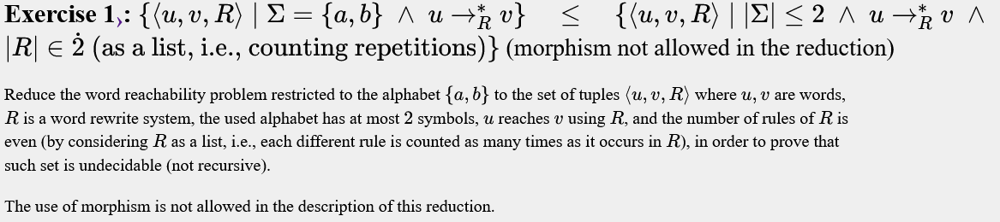
```text
u
v
l->r
l->r
```
Obtenim <u,v,R'>, on R' són les mateixes regles duplicades, ⇒ ∣R'∣ % 2 = 0.

---

## Exercise 2

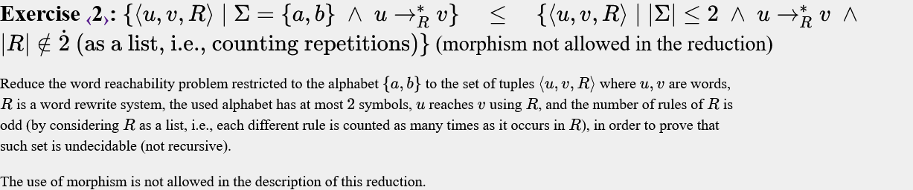
```text
u
v
l->r
l->r
u->u
```
Obtenim <u,v,R'>, on R' són les mateixes regles duplicades i la regla inútil u->u, ⇒ ∣R'∣ % 2 = 1. Perquè |l->r, l->r| és un nombre parell i |u->u| és senar.

---

## Exercise 3

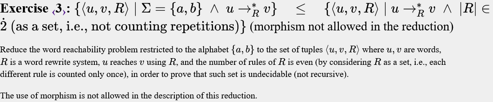
```text
u
v
l->i
i->r
```
Obtenim <u,v,R'>, on R' són les mateixes regles amb un pas intermig, és a dir, cada norma de reescriptura x -> y passa a ser x -> i, i -> y, on i és un identificador únic, pel que no tenim repeticions. Al afegir una regla extra per cada regla estem forçant que ∣R'∣ % 2 = 0.

---

## Exercise 4


```text
u
v
l->i
i->r
#->#
```

Seguim la mateixa idea, forrçem que sigui parell i afegim una regla inútil.

---

## Exercise 5

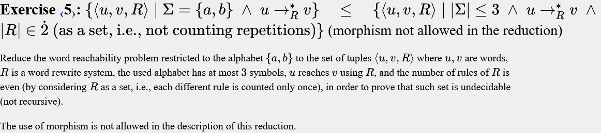
```textu
v
l->r
#l->#r
```

Aquí la restricció ∣Σ∣≤3 no ens permet usar i, que assigna un idenfiticador nou a cada regla. Usem un caràcter nou `#` al prinicpi de les regles, pel que tenim |l->r, #l->#r|, que és un nombre parell.

---

## Exercise 6

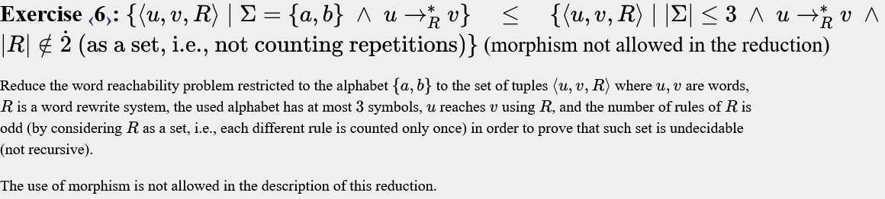
```text
u
v
l->r
#l->#r
#->#
```
El mateix, regles de mida parella (#l->#r) + regla més inútil (#->#) = regles de mida senar.

---

## Exercise 7

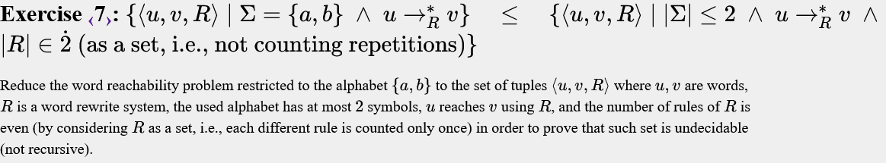
```text
s(a) = abba
s(b) = aba
s(#) = aa
s(u)
s(v)
s(l)->s(r)
s(#l)->s(#r)
```
Ara podem usar morfismes. Volem usar alguna cosa com (#l->#r), però sense usar #, ja que només podem tenir dos símbols.Hem triat aquest morfisme per evitar col·lisions entre cadenes.    

---

## Exercise 8

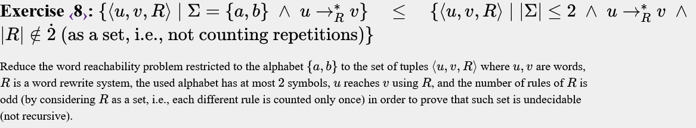
```text
s(a) = abba
s(b) = aba
s(#) = aa
s(u)
s(v)
s(l)->s(r)
s(#l)->s(#r)
s(#) -> s(#)
```
---

## Exercise 9

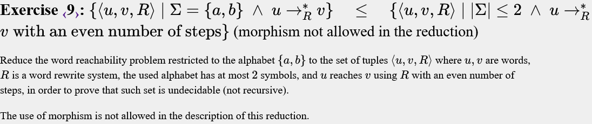
```text
u
v
l->r
u->u
```

- Cas positiu (u->*Rv)  
  Si es parell no faig servir la regla nova |parell|  
	Si es imparell faig servir la regla nova |parell|    
	
- Cas negatiu (u no té camí fins a v)
  No hi haurà cap camí parell  


---

## Exercise 10

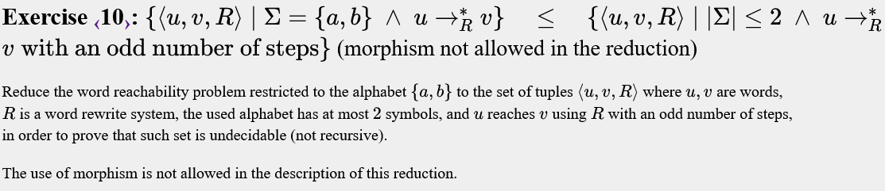
```text
u
v
l -> r 
u -> u
```

---

## Exercise 11

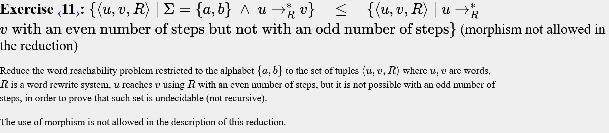
```text
u
v
l -> i
i -> r
```
<!--

---
 ## Exercise 12


```text


```

---

## Exercise 13


```text

```

---

## Exercise 14


```text

```

---

## Exercise 15


```text

```

---

## Exercise 16


```text


```

--- -->

## Exercise 17

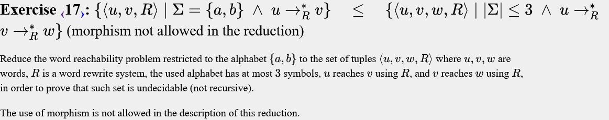
```text
u
v
# 
l->r
v->#

```
```
#        = W
l->r     Permet u->v
v->#     Permet u→R∗​v→R∗w
```
---

<!-- ## Exercise 18


```text

```

---

## Exercise 19


```text

```

---

## Exercise 20


```text


```

---

## Exercise 21


```text

```

---

## Exercise 22


```text

```

---

## Exercise 23


```text

```

---

## Exercise 24


```text

```

---

## Exercise 25


```text

```

---

## Exercise 26


```text

```

---

## Exercise 27


```text

```

---
## Exercise 28


```text

```

--- -->