# Expressions regulars

Tipus d'exercicis:

Normals : Definir variables i completar 
Múltiples : Es solen fer amb dfa's, però fer també pots fer
        
    m4 = ("0"|"1")* "00" | "" | "0";

Per tenir múltiples de 4, per exemple.

Morfismes : Substitution

NFA : DFA amb símbols que representen el mateix símbol. Acabarem fent morfisme del simbol pel símbol que representa.

Alguns et demanen camins de un node a un altre i has de fer cicles intermitjos.

## Exercise 1

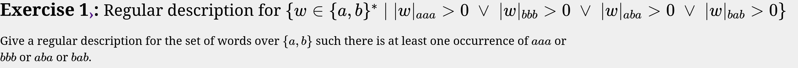

---

## Exercise 2

---

## Exercise 3

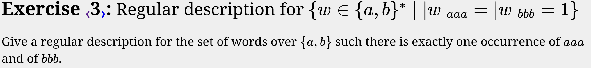

---

## Exercise 4

---

## Exercise 5

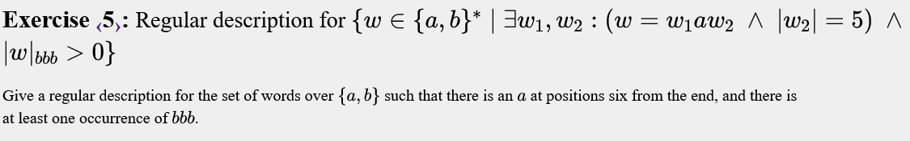

---

## Exercise 6

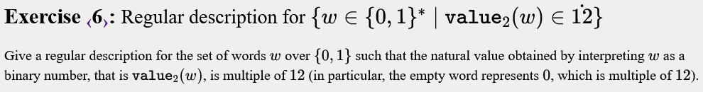

---

## Exercise 7

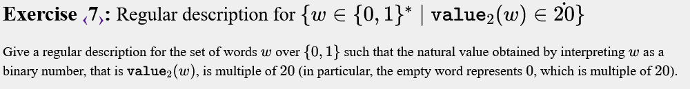

---

## Exercise 8

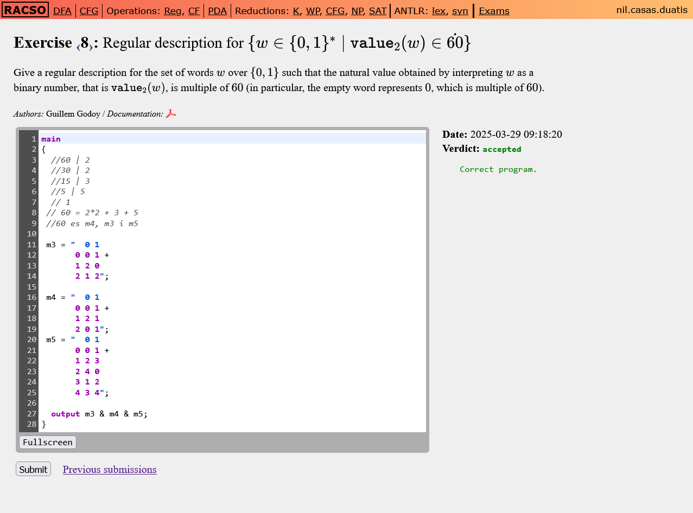

---

## Exercise 9

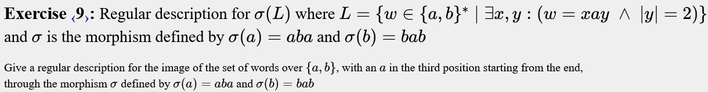

---

## Exercise 10

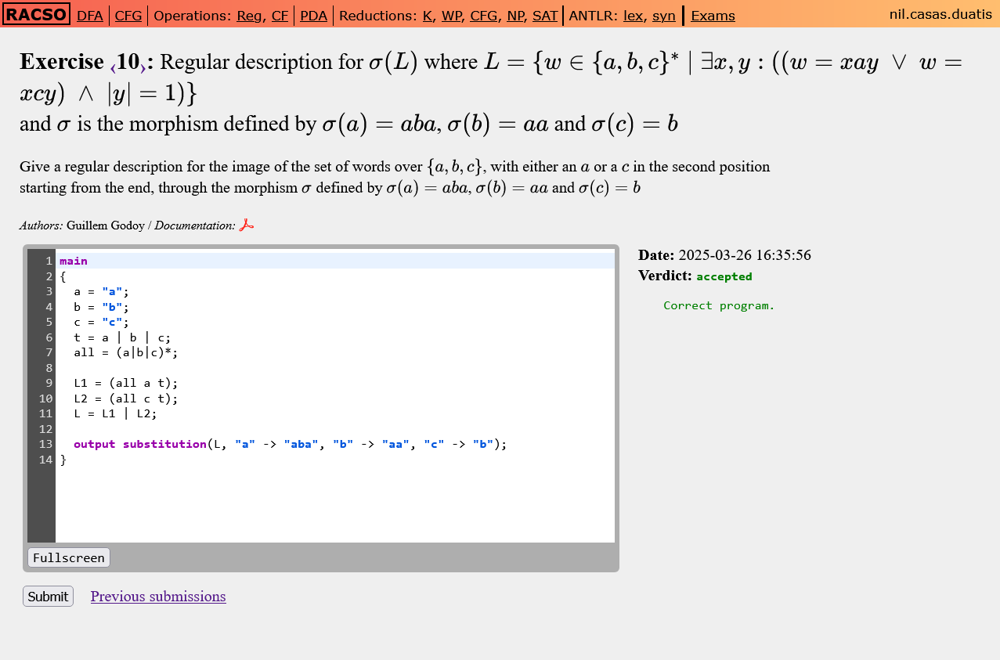

---

## Exercise 11

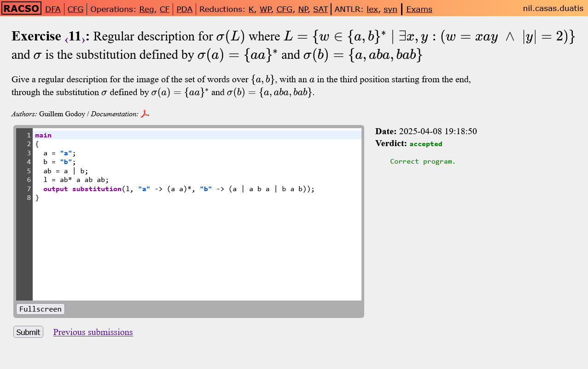

---

## Exercise 12

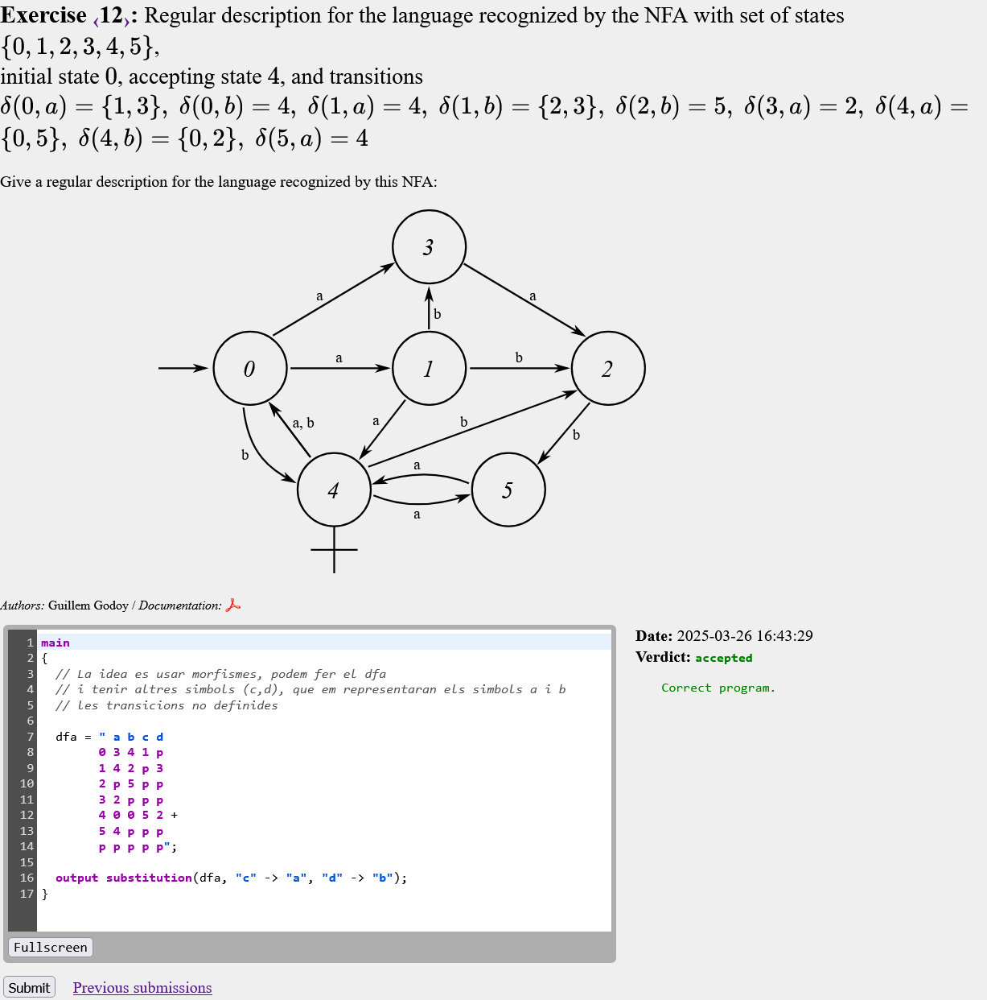

---

## Exercise 13

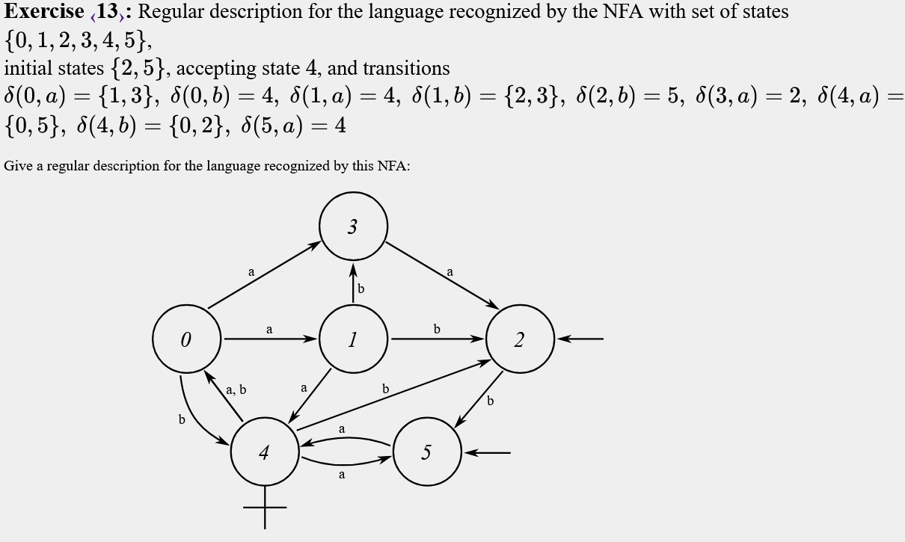

---

## Exercise 14

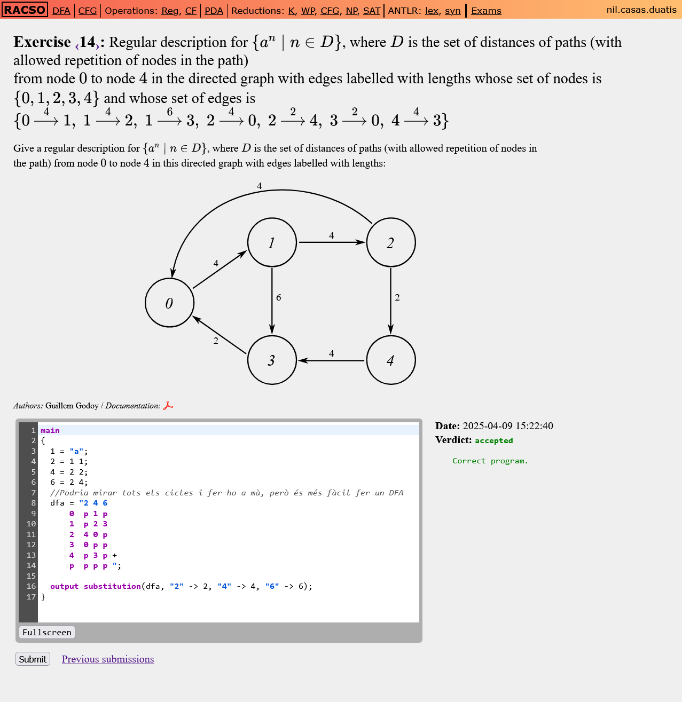

---

## Exercise 15

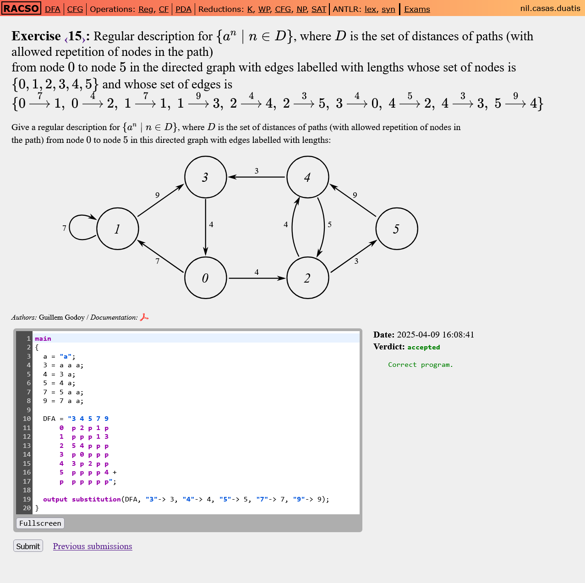

---

## Exercise 16

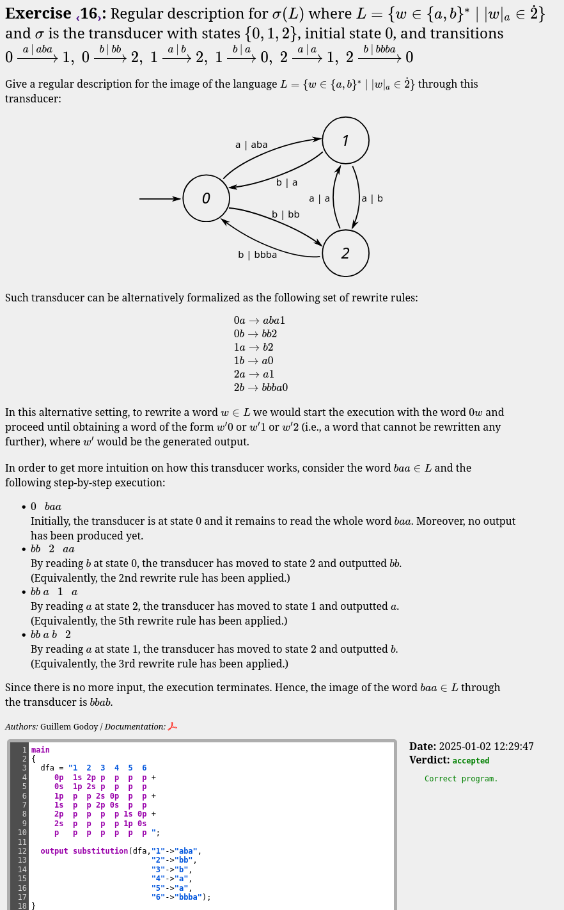

---

## Exercise 17

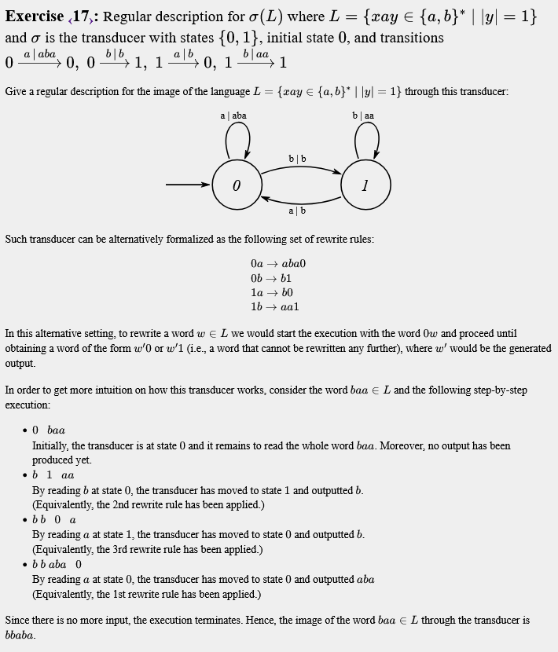

---

## Exercise 18

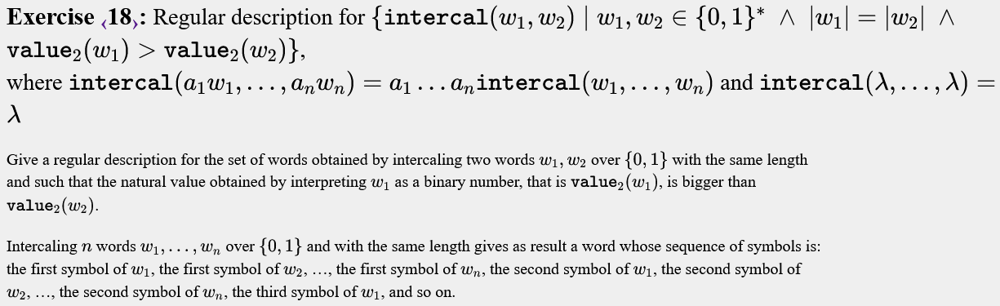

---

<!-- to finish -->