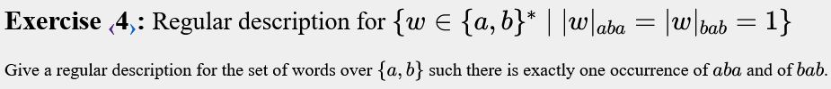
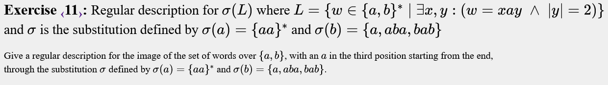
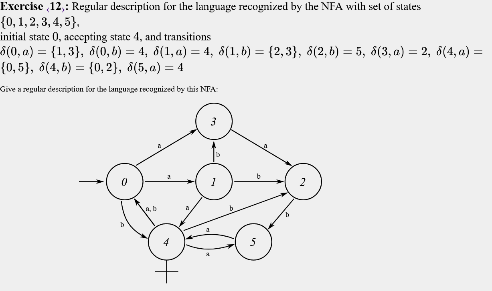
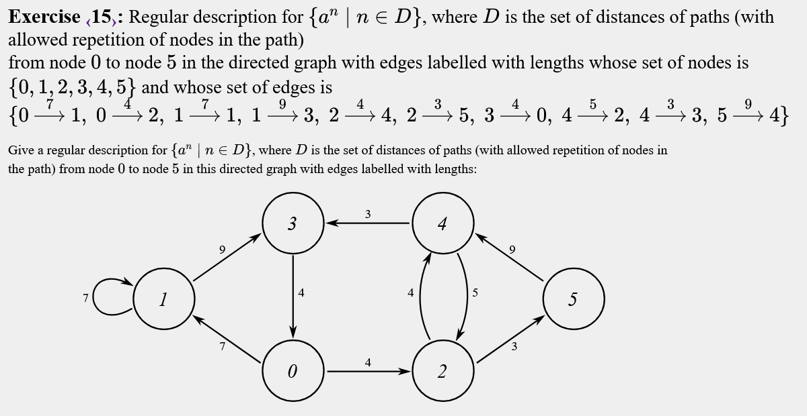

# Regular Expressions
<!-- 
# Expressions regulars
Tipus d'exercicis:

Normals : Definir variables i completar 
Múltiples : Es solen fer amb dfa's, però fer també pots fer
        
    m4 = ("0"|"1")* "00" | "" | "0";

Per tenir múltiples de 4, per exemple.

Morfismes : Substitution

NFA : DFA amb símbols que representen el mateix símbol. Acabarem fent morfisme del simbol pel símbol que representa.

Alguns et demanen camins de un node a un altre i has de fer cicles intermitjos. -->

## Exercise 1


```text
main
{
  word = "aaa" | "bbb" | "aba" | "bab";
  all = ("a"|"b")*;
  
  output all word all;     
}
```


## Exercise 2


```text
main
{
  a = "a";
  b = "b";
  t = a|b;
  L1 = t* "aaa" t*;
  L2 = substitution(L1, "a" -> "b", "b" -> "a");
  L3 = t* "aba" t*;
  L4 = substitution(L3, "a" -> "b", "b" -> "a");
  
  output L1 & L2 & L3 & L4;
}
```


## Exercise 3


```text
main
{ 
 a = "a";
 b = "b";

 all = ("a" | "b")*;
 
 L1 = all "aaa" all - (all "aaa" all "aaa" all) - (all "aaaa" all);
 L2 = substitution(L1, "b" -> "a", "a" -> "b");
 
 output L1 & L2;
}
```


Fàcil oblidar el segon cas d'L1
## Exercise 4


```text
main
{ 
 a = "a";
 b = "b";

 all = ("a" | "b")*;
  
 L1 = all "aba" all - (all "aba" all "aba" all) - (all "ababa" all);
 L2 = substitution(L1, "b" -> "a", "a" -> "b");
 
 output L1 & L2;
}
```
Mateixa idea que el 3

## Exercise 5


```text
main
{
  t = ("a" | "b");
  all = ("a" | "b")*;
  L1 = all "a" t t t t t;
  L2 = all "bbb" all;
  output L1 & L2;
}
```


## Exercise 6


```text
main
{
 m3 = "  0 1
       0 0 1 +
       1 2 0
       2 1 2";
  
 m4 = "  0 1
       0 0 1 +
       1 2 1
       2 0 1";

  output m3 & m4;
}
```

Els múltiples de 12 també són múltiples de 3 i de 4, ja que 12 es pot descompondre en factors primers (12 = 3 × 4). 

En lloc d'un DFA, es podria construir una expressió regular, com per exemple:

```text
  m4 = ("0"|"1")* "00" | "" | "0";
```


## Exercise 7


```text
main
{
 
 m4 = "  0 1
       0 0 1 +
       1 2 1
       2 0 1";
  
 m5 = "  0 1
       0 0 1 +
       1 2 3
       2 4 0
       3 1 2
       4 3 4";
    
  output m4 & m5;
}
```


## Exercise 8


  ```
  60 | 2
  30 | 2
  15 | 3
   5 | 5
   1
 
  60 = 4 x 3 x 5
  ```

```text
main
{ 
 m3 = "  0 1
       0 0 1 +
       1 2 0
       2 1 2";
  
 m4 = "  0 1
       0 0 1 +
       1 2 1
       2 0 1";
 m5 = "  0 1
       0 0 1 +
       1 2 3
       2 4 0
       3 1 2
       4 3 4";
    
  output m3 & m4 & m5;
}
```

## Exercise 9


```text
main
{
  a = "a";
  b = "b";
  t = a | b;
  all = (a|b)*;
  
  L = all a  t t;
  output substitution(L, "a" -> "aba", "b" -> "bab"); 
}
```


## Exercise 10


```text
main
{
  a = "a";
  b = "b";
  c = "c";
  t = a | b | c;
  all = (a|b|c)*;
  
  L1 = (all a t);
  L2 = (all c t);
  L = L1 | L2;
  
  output substitution(L, "a" -> "aba", "b" -> "aa", "c" -> "b"); 
}
```


## Exercise 11


```text
main
{
  a = "a";
  b = "b";
  ab = a | b;
  l = ab* a ab ab;
  output substitution(l, "a" -> (a a)*, "b" -> (a | a b a | b a b));
}
```


## Exercise 12


```text
main
{
  
  dfa = " a b c d
  	0 3 4 1 p
	1 4 2 p 3
	2 p 5 p p
	3 2 p p p
	4 0 0 5 2 +
	5 4 p p p
	p p p p p";
  
  output substitution(dfa, "c" -> "a", "d" -> "b");
}
```

  La idea és representar el DFA utilitzant morfismes. Primer es construeix el DFA amb altres símbols (com c i d) que representen les transicions dels símbols a i b, incloent-hi les transicions no definides.


## Exercise 13


```text
main
{
  dfa =  "a b c d
  	2 p 5 p p
	0 1 4 3 p
	1 4 2 p 3
	3 2 p p p
	4 0 0 5 2 +
	5 4 p p p
	p p p p p";

  dfa2 =  "a b c d
  	 5 4 p p p
	 0 1 4 3 p
	 1 4 2 p 3
	 2 p 5 p p
	 3 2 p p p
	 4 0 0 5 2 +
	 p p p p p";
  
  dfa = substitution(dfa, "c"->"a", "d" -> "b");
  dfa2 = substitution(dfa2, "c"->"a", "d" -> "b");
  
 output dfa | dfa2;
}
```
Per representar dos estats inicials es pot fer un dfa per cada estat inicial i una or al final. En aquest exemple, el primer DFA representa l'autòmata obtingut amb estat inicial 2, mentre que el segon DFA representa l'autòmata obtingut amb estat inicial 5.

## Exercise 14


```text
main
{
  1 = "a";
  2 = 1 1;
  4 = 2 2;
  6 = 2 4;
  dfa = "2 4 6
      0  p 1 p
      1  p 2 3
      2  4 0 p
      3  0 p p
      4  p 3 p +
      p  p p p ";
  
  output substitution(dfa, "2" -> 2, "4" -> 4, "6" -> 6);
}
```
Es podria mirar tots els cicles i fer-ho a mà, però és més fàcil fer el DFA.


## Exercise 15


```text
main
{
  a = "a";
  3 = a a a;
  4 = 3 a;
  5 = 4 a;
  7 = 5 a a;
  9 = 7 a a;
  
  DFA = "3 4 5 7 9
      0  p 2 p 1 p
      1  p p p 1 3
      2  5 4 p p p
      3  p 0 p p p
      4  3 p 2 p p
      5  p p p p 4 +
      p  p p p p p";
  
  output substitution(DFA, "3"-> 3, "4"-> 4, "5"-> 5, "7"-> 7, "9"-> 9);
}
```


## Exercise 16


```text
main
{
  dfa = "1  2  3  4  5  6
     0p  1s 2p p  p  p  p +
     0s  1p 2s p  p  p  p
     1p  p  p 2s 0p  p  p +	
     1s  p  p 2p 0s  p  p
     2p  p  p  p  p 1s 0p +
     2s  p  p  p  p 1p 0s 
     p   p  p  p  p  p  p ";
  
  output substitution(dfa,"1"->"aba",
		      	  "2"->"bb",
		          "3"->"b",
		          "4"->"a",
		          "5"->"a",
		          "6"->"bbba");
}
```


## Exercise 17


```text
main
{
   L ="    a  b	 c   d
	A0 p  1	 A1  p
	A1 p AB	 AA  p
	1  p A1	 p   1
	AA p AB	 AA  p +
	AB p A1	 p   1 +
	p  p p	 p   p";
  
    output substitution(L, "c" -> "aba", "d" -> "aa");
}
```

## Exercise 18


```text
main
{
  
  0 = "0";
  1 = "1";
  t = 0 | 1;
  
  output (0 0 | 1 1)* (1 0)  (t t)*;
}
```
```
Intercalar és, per exemple, si tenim *w1* i *w2*:
- w1 = abc
- w2 = def
La intercalació seria 
- adbecf
```
En aquest exercici en concret, si volem tenir *w1 > w2*, cal mantenir els mateixos ('00' o '11') fins que que hi hagi un *1* a *w1* i un *0* a *w2*, seguint un format binari.

## Exercise 19


```text
main
{
  0 = "0";
  1 = "1";
  t = 0 | 1;
  
  output (0 0 | 1 1)* (0 1)  (t t)*;
}
```
Aquest exercici és el mateix que l'anterior però en lloc de *>* ens demanen *<*. Si volem tenir *w1 < w2*, cal mantenir els mateixos ('00' o '11') fins que que hi hagi un *0* a *w1* i un *1* a *w2*.

## Exercise 20


```text
main
{
  0 = "0";
  1 = "1";
  t = 0|1;
  igual = 0 0 0 | 1 1 1; 
  all = 0 0 0 | 0 0 1 | 0 1 0 | 0 1 1 | 1 0 0 | 1 0 1 | 1 1 0 | 1 1 1;
  
  output igual* 
        (
        1 1 0 ((0 0 | 1 1) t )* (1 0 t) 
        |
        1 0 0 (t  (0 0 | 1 1))* (t 1 0)) 
        all*;
}
```
Aquest es com el 18, però enlloc de tenir parelles de bits anirem de 3 en 3. Si volem tenir *w1 > w2 > w3 *, tindrem dos casos generals:
- Si comença amb "110", seguit d'empats entre *w1 i w2* ((0 0 | 1 1) (0 | 1))*, fins que finalment amb (1 0 (0|1)*) acabem amb *w1 > w2*.
- Si comença amb "100", seguit d'empats entre *w2 i w3* (t  (0 0 | 1 1))*, acabant amb ((0|1)* 1 0), garantint *w2 > w3*.

## Exercise 21


```text
main
{
  0 = "0";
  1 = "1";
  t = 0|1;
  igual = 0 0 0 | 1 1 1; 
  all = 0 0 0 | 0 0 1 | 0 1 0 | 0 1 1 | 1 0 0 | 1 0 1 | 1 1 0 | 1 1 1;
  
  output igual*
         ( 
         1 0 0 (t (0 0 | 1 1))* t 0 1	
         | 
         0 0 1 ((0 0 | 1 1) t)* 1 0 t
         |
         1 0 1	 
         )
         all*;
}
```
Aquí tinc 3 casos:
  - 1 0 0 (t (0 0 | 1 1))* t 0 1:	 Primer es veu que *w1 > w2* i després *w2 < w3*
  - 0 0 1 ((0 0 | 1 1) t)* 1 0 t:  Primer es veu que *w2 < w3* i després *w1 > w2*
  - 1 0 1	                      :  Es veu directament que  *w1 > w2 < w3*


## Exercise 22


```text
main
{
  0 = "0";
  1 = "1";
  t = 0|1;
  igual = 0 0 | 1 1; 
  all = 0 0 | 0 1 | 1 0 | 1 1;
  
  output igual* 1 0 ((all)* - (0 1)*); 	
}
```
Aquí cal intercalar només *w1* i *w3*, hiha d'haver com a mínim una paraula *w2* entre aquestes dues.

Primer llegeixo (1 0) per assegurar *w1 > w3*, i per tenir *w2* 'dins', necessito evitar llegir 01, ja que:

- w = 1001 ⇒ w1 = 10 (2 en decimal) i  w3 = 01 (1 en decimal), no existeix un altre nombre *w2*  tal que *w1 > w2 > w3*

## Exercise 23


```text
main
main
{
  1 = "1";
  0 = "0";
  igual = 0 0 0 | 1 0 1 | 0 1 1;

  carry = 1 0 0 | 0 1 0 | 1 1 1;
  igualCarry = (0 0 1) carry* (1 1 0);
  
  output (igual | igualCarry)*;
}
```
Aquí utilitzem el cas evident *igual*, en que *w1 + w2 = w3* i afegim el 'carry'. Representa la suma quan *w1 + w2 = w3 +1*
<!-- 23 incomplet : -->