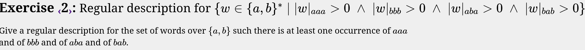
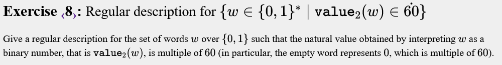
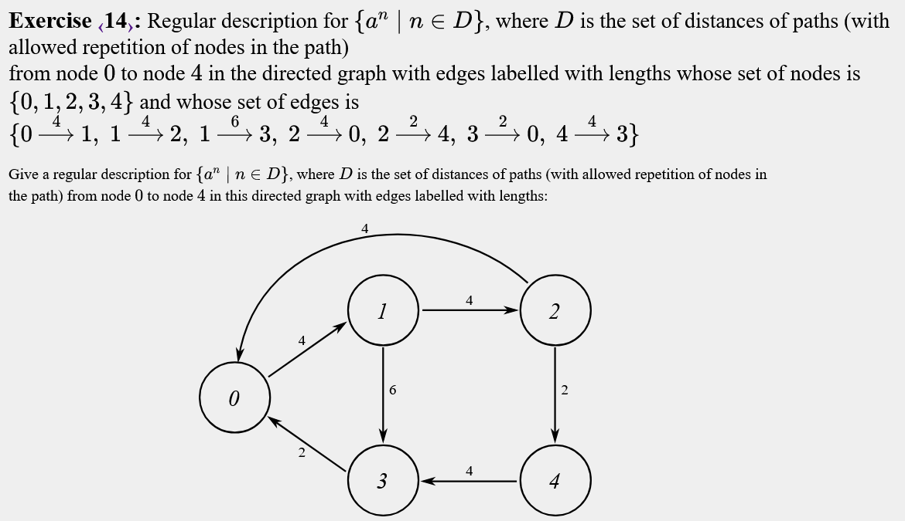

# Regular Expressions
<!-- 
# Expressions regulars
Tipus d'exercicis:

Normals : Definir variables i completar 
Múltiples : Es solen fer amb dfa's, però fer també pots fer
        
    m4 = ("0"|"1")* "00" | "" | "0";

Per tenir múltiples de 4, per exemple.

Morfismes : Substitution

NFA : DFA amb símbols que representen el mateix símbol. Acabarem fent morfisme del simbol pel símbol que representa.

Alguns et demanen camins de un node a un altre i has de fer cicles intermitjos. -->

## Exercise 1


```text
main
{
  word = "aaa" | "bbb" | "aba" | "bab";
  all = ("a"|"b")*;
  
  output all word all;     
}
```


## Exercise 2


```text
main
{
  a = "a";
  b = "b";
  t = a|b;
  L1 = t* "aaa" t*;
  L2 = substitution(L1, "a" -> "b", "b" -> "a");
  L3 = t* "aba" t*;
  L4 = substitution(L3, "a" -> "b", "b" -> "a");
  
  output L1 & L2 & L3 & L4;
}
```


## Exercise 3


```text
main
{ 
 a = "a";
 b = "b";

 all = ("a" | "b")*;
 
 L1 = all "aaa" all - (all "aaa" all "aaa" all) - (all "aaaa" all);
 L2 = substitution(L1, "b" -> "a", "a" -> "b");
 
 output L1 & L2;
}
```


Fàcil oblidar el segon cas d'L1
## Exercise 4


```text

```


## Exercise 5


```text

```


## Exercise 6


```text

```


## Exercise 7


```text

```


## Exercise 8


```text

```


## Exercise 9


```text

```


## Exercise 10


```text

```


## Exercise 11


```text

```


## Exercise 12


```text

```


## Exercise 13


```text

```


## Exercise 14


```text

```


## Exercise 15


```text

```


## Exercise 16


```text

```


## Exercise 17


```text

```


## Exercise 18


```text

```


<!-- to finish -->