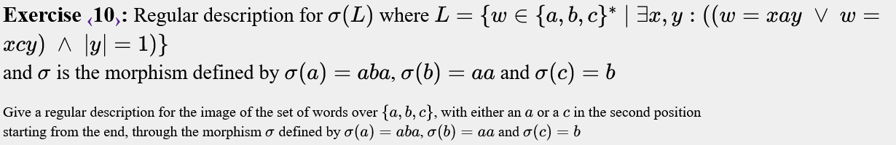
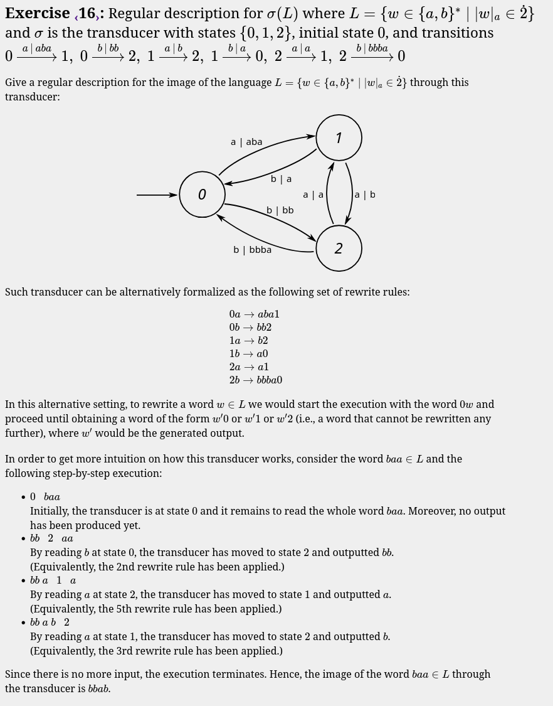

# Expressions regulars

Tipus d'exercicis:

Normals : Definir variables i completar 
Múltiples : Es solen fer amb dfa's, però fer també pots fer
        
    m4 = ("0"|"1")* "00" | "" | "0";

Per tenir múltiples de 4, per exemple.

Morfismes : Substitution

NFA : DFA amb símbols que representen el mateix símbol. Acabarem fent morfisme del simbol pel símbol que representa.

Alguns et demanen camins de un node a un altre i has de fer cicles intermitjos.

## Exercise 1

---

## Exercise 2

---

## Exercise 3

---

## Exercise 4

---

## Exercise 5

---

## Exercise 6

---

## Exercise 7

---

## Exercise 8

---

## Exercise 9

---

## Exercise 10

---

## Exercise 11

---

## Exercise 12

---

## Exercise 13

---

## Exercise 14

---

## Exercise 15

---

## Exercise 16

---

## Exercise 17

---

## Exercise 18

---

<!-- to finish -->